# ERP Application Requirements Document
## Complete MISA AMIS Clone Specification

**Source:** [GitHub Issue #632](https://github.com/stevennt/abn.launchpad/issues/632)  
**Repository:** stevennt/abn.launchpad  
**Author:** stevennt (ABN Software)  
**Created:** March 2026  
**Total Screenshots:** 73 images (all downloaded to `/assets`)  

---

## 📌 Executive Summary

This document contains the complete requirements for building an ERP application cloned from **MISA AMIS** - a comprehensive Vietnamese enterprise resource planning platform. The system integrates **all business operations on a single software platform** with modular architecture and AI-powered features.

**Key Vision:** "TẤT CẢ NGHIỆP VỤ KẾ TOÁN TRÊN 1 PHẦN MỀM" (All Accounting Operations on 1 Software)

---

## 📸 Complete Screenshot Catalog (73 Images)

### Image 01: Core ERP Module Overview
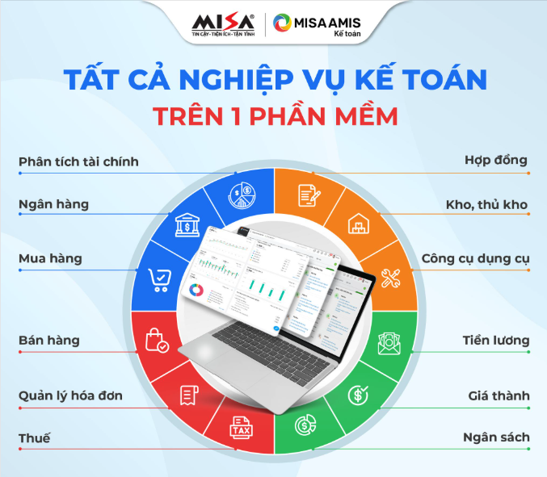

**Description:** Main marketing graphic showing all accounting and business operations available in a single software. Features a circular diagram with laptop, tablet, and mobile device in the center showing dashboards. Twelve business modules surround the center:

**Left side (Blue - Financial):**
- Phân tích tài chính (Financial Analysis)
- Ngân hàng (Banking)
- Mua hàng (Purchasing)
- Bán hàng (Sales)
- Quản lý hóa đơn (Invoice Management)
- Thuế (Tax)

**Right side (Orange/Green - Operations):**
- Hợp đồng (Contracts)
- Kho, thủ kho (Warehouse & Inventory)
- Công cụ dụng cụ (Tools & Equipment)
- Tiền lương (Payroll)
- Giá thành (Costing)
- Ngân sách (Budget)

**Branding:** MISA logo with tagline "TIN CẬY - TIỆN ÍCH - TẬN TÂM" and MISA AMIS Kế toán branding.

---

### Image 02: Employee Onboarding Email Template
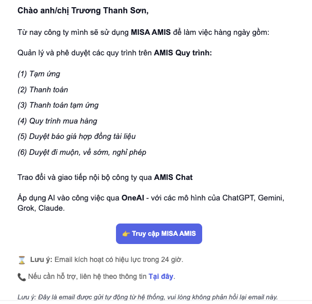

**Description:** Automated welcome email sent to new employee Trương Thanh Sơn. The email informs the new hire about the company's adoption of MISA AMIS platform for daily operations.

**Content:**
- Greeting: "Chào anh/chị Trương Thanh Sơn"
- Notification that the company will now use MISA AMIS for daily work
- Lists 6 workflows available in AMIS Quy trình:
  1. Tạm ứng (Advance payment)
  2. Thanh toán (Payment)
  3. Thanh toán tạm ứng (Advance payment settlement)
  4. Quy trình mua hàng (Purchasing workflow)
  5. Duyệt báo giá hợp đồng tài liệu (Contract quotation approval)
  6. Duyệt đi muộn, về sớm, nghỉ phép (Late/early leave/leave approval)
- Mentions internal communication via AMIS Chat
- AI integration via OneAI with models: ChatGPT, Gemini, Grok, Claude
- Blue CTA button: "Truy cập MISA AMIS" (Access MISA AMIS)
- Note: Activation email valid for 24 hours
- Support link available
- Auto-generated email notice

---

### Image 03: Platform Onboarding Guide (Step 1-3)
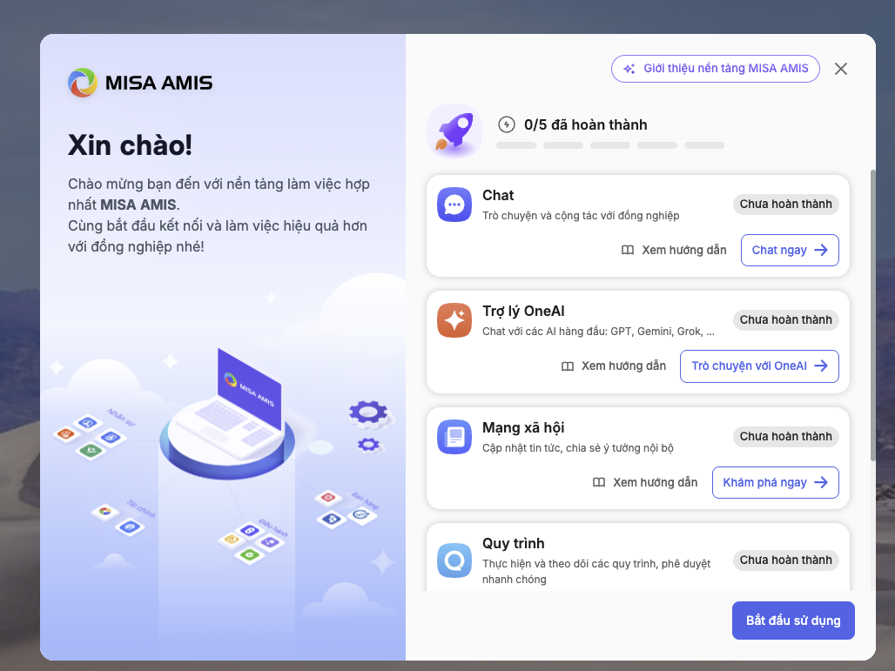

**Description:** Welcome modal dialog for new users starting the MISA AMIS platform onboarding process.

**Left Panel:**
- MISA AMIS logo
- Welcome message: "Xin chào! Chào mừng bạn đến với nền tảng làm việc hợp nhất MISA AMIS."
- Illustration showing laptop with MISA AMIS logo connected to various module icons (Nhân sự, Tài chính, Điều hành, Bán hàng)

**Right Panel:**
- Progress indicator: "0/5 đã hoàn thành" (0/5 completed)
- 5 onboarding steps (all showing "Chưa hoàn thành" - Not completed):
  1. **Chat** - "Trò chuyện và cộng tác với đồng nghiệp" (Chat and collaborate with colleagues) with "Chat ngay" button
  2. **Trợ lý OneAI** - "Chat với các AI hàng đầu: GPT, Gemini, Grok,..." (Chat with leading AI: GPT, Gemini, Grok) with "Trò chuyện với OneAI" button
  3. **Mạng xã hội** - "Cập nhật tin tức, chia sẻ ý tưởng nội bộ" (Update news, share internal ideas) with "Khám phá ngay" button
  4. **Quy trình** - "Thực hiện và theo dõi các quy trình, phê duyệt nhanh chóng" (Execute and track workflows, quick approvals) with "Khám phá ngay" button

**Bottom:** Blue button "Bắt đầu sử dụng" (Start using)

---

### Image 04: Platform Onboarding Guide (Step 4-5)
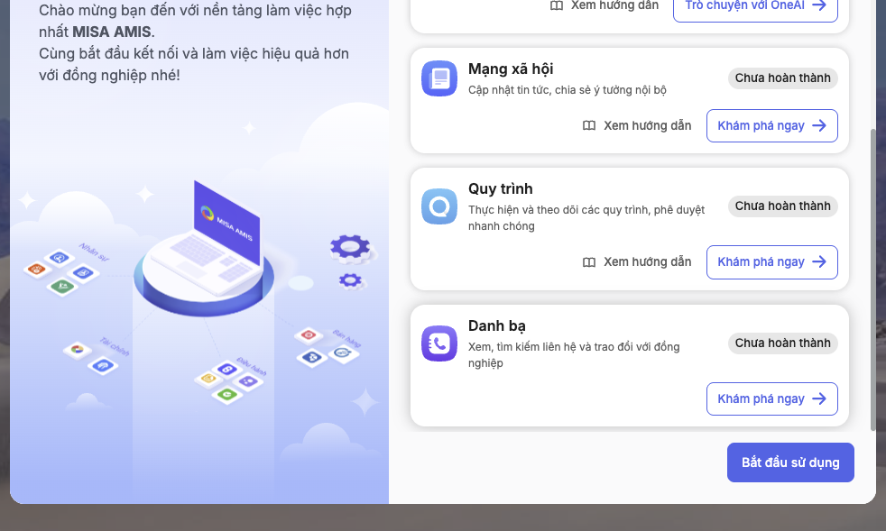

**Description:** Continuation of the onboarding modal showing the remaining 2 steps:

5. **Danh bạ** - "Xem, tìm kiếm liên hệ và trao đổi với đồng nghiệp" (View, search contacts and communicate with colleagues) with "Khám phá ngay" button

**Bottom:** Blue button "Bắt đầu sử dụng" (Start using)

---

### Image 05: Desktop App Dashboard (My Apps View)
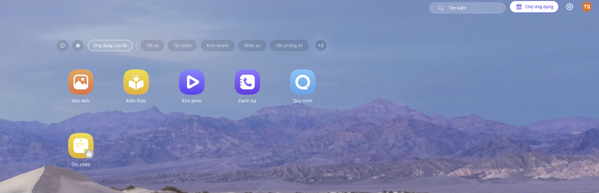

**Description:** Main dashboard interface with mountain landscape background wallpaper. Shows user's installed apps as large icons.

**Top Navigation:**
- Clock icon (Recent)
- Star icon (Favorites)
- Filter tabs: "Ứng dụng của tôi" (My apps - selected), "Tất cả" (All), "Tài chính" (Finance), "Kinh doanh" (Business), "Nhân sự" (HR), "Văn phòng số" (Digital Office), "+2" (More)
- Search bar with "Tìm kiếm" placeholder
- "Chợ ứng dụng" (App Market) button
- Settings gear icon
- User avatar "TS" (Trương Sơn)

**App Icons Displayed:**
- Kho ảnh (Photo Library) - Orange icon with image symbol
- Kiến thức (Knowledge) - Yellow icon with book and sun
- Kho phim (Video Library) - Purple icon with play button
- Danh bạ (Contacts) - Purple icon with phone
- Quy trình (Workflow) - Light blue icon with Q
- Ghi chép (Notes) - Yellow icon with document (has lock overlay)

---

### Image 06: Application Marketplace - Full Catalog
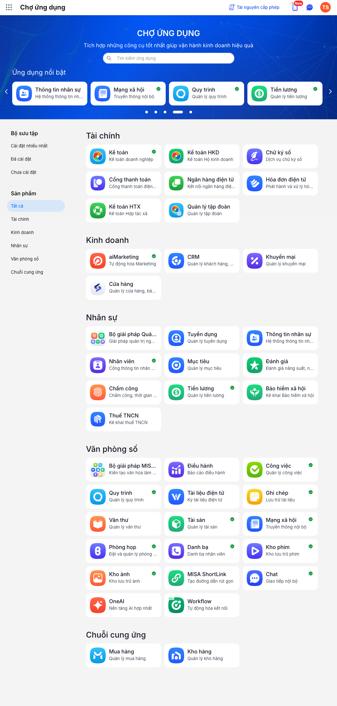

**Description:** Complete application marketplace interface showing all available apps organized by category.

**Header:**
- "CHỢ ỨNG DỤNG" (Application Market)
- Subtitle: "Tích hợp những công cụ tốt nhất giúp vận hành kinh doanh hiệu quả" (Integrating the best tools to help operate business effectively)
- Search bar: "Tìm kiếm ứng dụng"
- "Ứng dụng nổi bật" (Featured apps) carousel showing: Thông tin nhân sự, Mạng xã hội, Quy trình, Tiền lương

**Left Sidebar Navigation:**
- Bộ sưu tập (Collections): Cài đặt nhiều nhất (Most installed), Đã cài đặt (Installed), Chưa cài đặt (Not installed)
- Sản phẩm (Products): Tất cả (All), Tài chính (Finance), Kinh doanh (Business), Nhân sự (HR), Văn phòng số (Digital Office), Chuỗi cung ứng (Supply Chain)

**Main Content - Finance Section (Tài chính):**
1. Kế toán (Accounting) - Enterprise accounting ✓
2. Kế toán HKD (Business Household Accounting)
3. Chữ ký số (Digital Signature)
4. Cổng thanh toán (Payment Gateway)
5. Ngân hàng điện tử (E-Banking)
6. Hóa đơn điện tử (E-Invoice)
7. Kế toán HTX (Cooperative Accounting)
8. Quản lý tập đoàn (Group Management)

**Business Section (Kinh doanh):**
1. aiMarketing (Marketing Automation) ✓
2. CRM (Customer Relationship Management)
3. Khuyến mại (Promotion Management)
4. Cửa hàng (Store/Retail Management)

**HR Section (Nhân sự):**
1. Bộ giải pháp Quản trị nhân sự (HR Management Solution)
2. Tuyển dụng (Recruitment)
3. Thông tin nhân sự (HR Information)
4. Nhân viên (Employee) ✓
5. Mục tiêu (Objectives)
6. Đánh giá (Evaluation)
7. Chấm công (Time & Attendance)
8. Tiền lương (Payroll) ✓
9. Bảo hiểm xã hội (Social Insurance)
10. Thuế TNCN (Personal Income Tax)

**Digital Office Section (Văn phòng số):**
1. Bộ giải pháp MISA (MISA Solution)
2. Điều hành (Operations Dashboard)
3. Công việc (Tasks) ✓
4. Quy trình (Workflow) ✓
5. Tài liệu điện tử (Electronic Documents)
6. Ghi chép (Notes) ✓
7. Văn thư (Correspondence)
8. Tài sản (Assets) ✓
9. Mạng xã hội (Social Network) ✓
10. Phòng họp (Meeting Room) ✓
11. Danh bạ (Contacts) ✓
12. Kho phim (Video Library) ✓
13. Kho ảnh (Photo Library) ✓
14. MISA ShortLink (URL Shortener)
15. Chat (Internal Chat) ✓
16. OneAI (AI Platform)
17. Workflow (Workflow Automation)

**Supply Chain Section (Chuỗi cung ứng):**
1. Mua hàng (Purchasing)
2. Kho hàng (Warehouse)

---

### Image 07: Application Marketplace - Installed Apps View
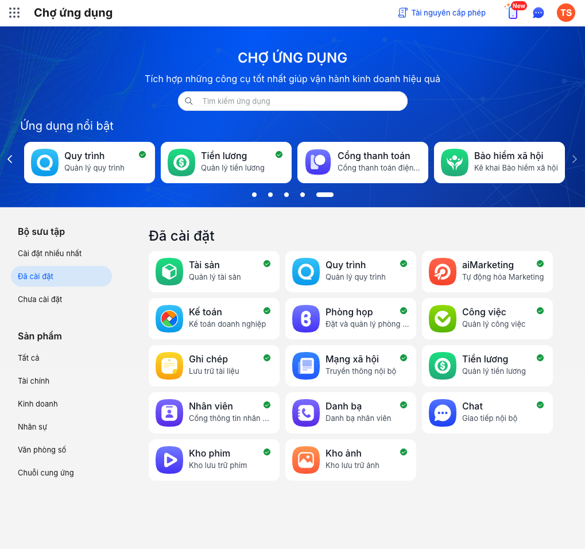

**Description:** Same marketplace interface showing "Đã cài đặt" (Installed) filter view.

**Featured Apps Carousel:**
- Quy trình (Workflow) ✓
- Tiền lương (Payroll) ✓
- Cổng thanh toán (Payment Gateway)
- Bảo hiểm xã hội (Social Insurance)

**Installed Apps Grid (16 apps with green checkmarks):**
1. Tài sản (Assets)
2. Quy trình (Workflow)
3. aiMarketing (Marketing Automation)
4. Kế toán (Accounting)
5. Phòng họp (Meeting Room)
6. Công việc (Tasks)
7. Ghi chép (Notes)
8. Mạng xã hội (Social Network)
9. Tiền lương (Payroll)
10. Nhân viên (Employee)
11. Danh bạ (Contacts)
12. Chat (Internal Chat)
13. Kho phim (Video Library)
14. Kho ảnh (Photo Library)

---

### Image 08: Asset Management - Product Detail Page
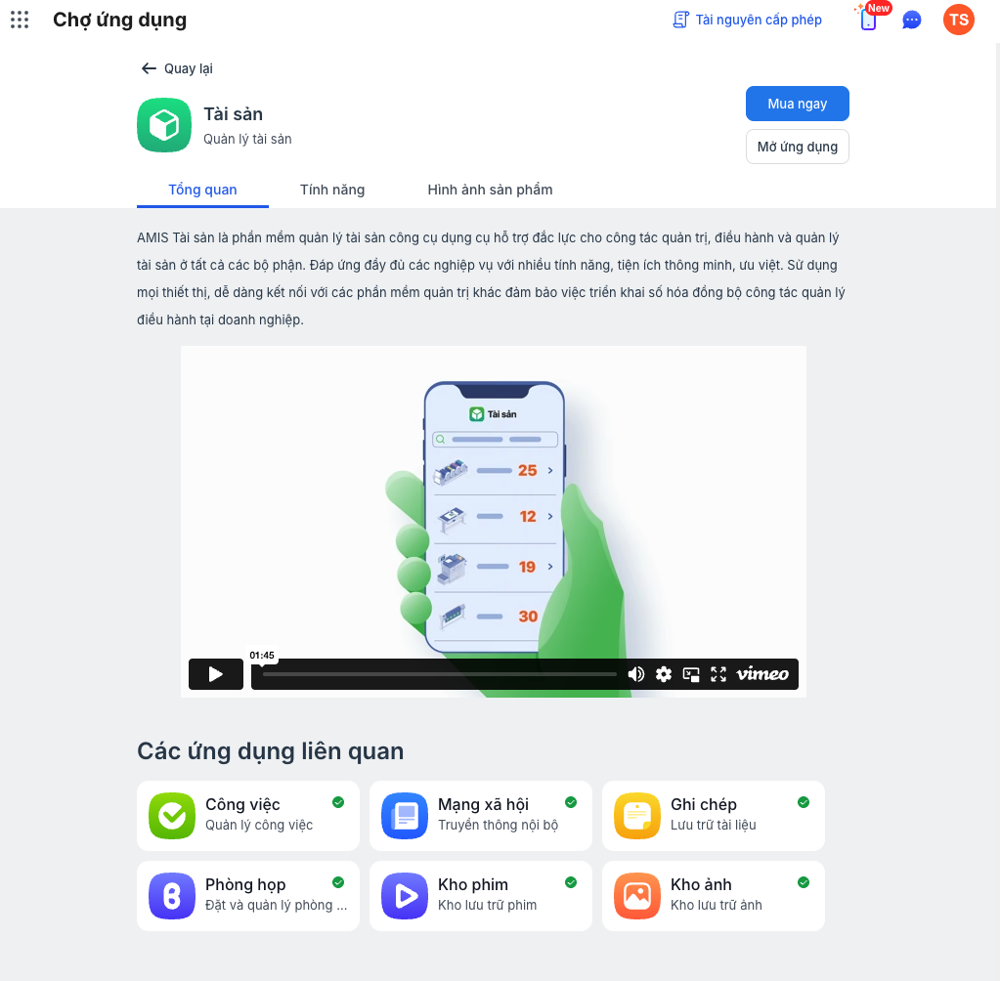

**Description:** App marketplace detail page for the Asset Management (Tài sản) module.

**Header:**
- App icon (green cube)
- Title: "Tài sản - Quản lý tài sản" (Assets - Asset Management)
- Buttons: "Mua ngay" (Buy Now), "Mở ứng dụng" (Open App)

**Tabs:** Tổng quan (Overview - selected), Tính năng (Features), Hình ảnh sản phẩm (Product Images)

**Description Text:**
"AMIS Tài sản là phần mềm quản lý tài sản công cụ dụng cụ hỗ trợ đắc lực cho công tác quản trị, điều hành và quản lý tài sản ở tất cả các bộ phận. Đáp ứng đầy đủ các nghiệp vụ với nhiều tính năng, tiện ích thông minh, ưu việt. Sử dụng mọi thiết bị, dễ dàng kết nối với các phần mềm quản trị khác đảm bảo việc triển khai số hóa đồng bộ công tác quản lý điều hành tại doanh nghiệp."

**Video Preview:**
- Mobile phone mockup showing asset list with counts (25, 12, 19, 30)
- Video player controls (Vimeo)
- Duration: 01:45

**Related Apps (Các ứng dụng liên quan):**
- Công việc (Tasks) ✓
- Mạng xã hội (Social Network) ✓
- Ghi chép (Notes) ✓
- Phòng họp (Meeting Room) ✓
- Kho phim (Video Library) ✓
- Kho ảnh (Photo Library) ✓

---

### Image 09: aiMarketing - Product Detail Page
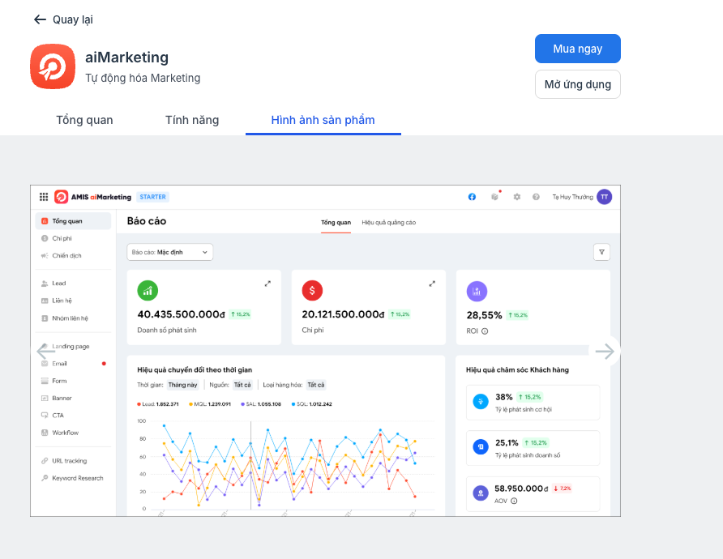

**Description:** App marketplace detail page for aiMarketing module showing product screenshots.

**Header:**
- App icon (orange with P logo)
- Title: "aiMarketing - Tự động hóa Marketing" (Marketing Automation)
- Buttons: "Mua ngay" (Buy Now), "Mở ứng dụng" (Open App)

**Tabs:** Tổng quan (Overview), Tính năng (Features), Hình ảnh sản phẩm (Product Images - selected)

**Screenshot Shows aiMarketing Dashboard:**
- Top bar: AMIS aiMarketing STARTER, user "Tạ Huy Thường"
- Left sidebar navigation: Tổng quan (Overview), Chi phí (Costs), Chiến dịch (Campaigns), Lead, Liên hệ (Contacts), Nhóm liên hệ (Contact Groups), Landing page, Email, Form, Banner, CTA, Workflow, URL tracking, Keyword Research

**Main Dashboard - Báo cáo (Reports):**
- Top tabs: Tổng quan (Overview - selected), Hiệu quả quảng cáo (Ad Performance)

**Key Metrics Cards:**
1. **Doanh số phát sinh** (Generated Revenue): 40,435,500,000đ ↑15.2%
2. **Chi phí** (Costs): 20,121,500,000đ ↑15.2%
3. **ROI**: 28.55% ↑15.2%

**Conversion Performance Chart (Hiệu quả chuyển đổi theo thời gian):**
- Filters: Thời gian: Tháng này (This month), Nguồn: Tất cả (All sources), Loại hàng hóa: Tất cả (All products)
- Line chart with 4 metrics:
  - Lead: 1,852,371 (red)
  - MQL: 1,239,091 (yellow)
  - SAL: 1,055,108 (purple)
  - SQL: 1,012,242 (blue)

**Customer Care Effectiveness (Hiệu quả chăm sóc Khách hàng):**
1. Tỷ lệ phát sinh cơ hội (Opportunity Rate): 38% ↑15.2%
2. Tỷ lệ phát sinh doanh số (Revenue Rate): 25.1% ↑15.2%
3. AOV (Average Order Value): 58,950,000đ ↓7.2%

---

### Image 10: aiMarketing - Features List
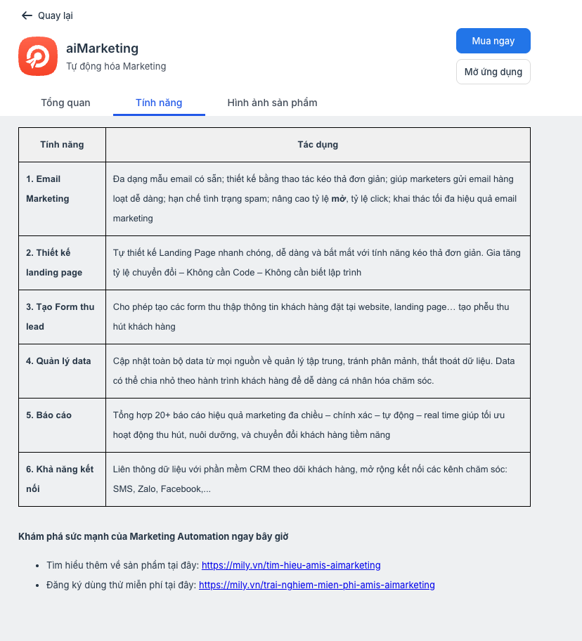

**Description:** Features specification table for aiMarketing module.

**Features Table:**

| # | Tính năng (Feature) | Tác dụng (Purpose) |
|---|---------------------|-------------------|
| 1 | **Email Marketing** | Diverse email templates; drag-and-drop design; bulk email sending; spam filtering; improve open rates, click rates; maximize email marketing effectiveness |
| 2 | **Thiết kế landing page** (Landing Page Design) | Quick landing page design with drag-and-drop; no coding required; increase conversion rates |
| 3 | **Tạo Form thu lead** (Lead Collection Form) | Create forms to collect customer information on websites, landing pages; create profiles to attract customers |
| 4 | **Quản lý data** (Data Management) | Centralized data management from all sources; prevent fragmentation and data loss; segment data by customer journey for personalized care |
| 5 | **Báo cáo** (Reports) | 20+ multi-dimensional marketing reports; accurate, automatic, real-time; optimize actions, nurture and convert potential customers |
| 6 | **Khả năng kết nối** (Integration Capability) | Data integration with CRM software; expand connections with channels: SMS, Zalo, Facebook |

**Bottom Links:**
- Learn more: https://mily.vn/tim-hieu-amis-aimarketing
- Free trial registration: https://mily.vn/trai-nghiem-mien-phi-amis-aimarketing

---

### Image 11: Asset Management - Dashboard Overview

**Description:** Main dashboard of the Asset Management (Tài sản) module with comprehensive visualizations.

**Top Header:**
- App icon and title: "Tài sản" (Assets)
- Company selector: "Công ty cổ phần MISA" (MISA Joint Stock Company)
- Top right: Add, Notification (2), Settings, Help, User avatar

**Left Navigation Menu:**
- Tổng quan (Overview) - Active
- Tài sản (Assets)
- Cấp phát - Thu hồi (Allocation - Recovery)
- Điều chuyển (Transfer)
- Sửa chữa - Bảo dưỡng (Repair - Maintenance)
- Mất - Hủy - Thanh lý (Loss - Destroy - Disposal)
- Kiểm kê (Inventory)
- Báo cáo (Reports)
- Thiết lập (Settings)

**Main Content - 4 Dashboard Widgets:**

**1. Asset Status Chart (Biểu đồ tài sản theo tình trạng):**
- Donut chart showing 165 total assets
- Breakdown:
  - Chưa sử dụng (Not yet used): 30
  - Đang sử dụng (In use): 60
  - Đang bảo dưỡng (Under maintenance): 24
  - Đang sửa chữa (Being repaired): 10
  - Báo hỏng (Damaged report): 10
  - Đã hỏng (Broken): 5
  - Đã mất (Lost): 5
  - Bảo mất (Insurance loss): 5
  - Đã hủy (Destroyed): 5
  - Đề nghị thanh lý (Proposed for disposal): 5
  - Đang điều chuyển (In transfer): 3

**2. Asset Movement Chart (Biểu đồ biến động tài sản):**
- Combined bar and line chart
- X-axis: T1-T12 (Months 1-12)
- Left Y-axis: Số lượng tài sản (Asset quantity) 0-500
- Right Y-axis: Tổng giá trị tài sản (Total asset value) 0-4,000
- Green bars: Quantity
- Orange line: Value

**3. Asset Repair Status Chart (Biểu đồ tình hình sửa chữa tài sản):**
- Combined bar and line chart
- X-axis: T1-T12 (Months 1-12)
- Left Y-axis: Chiếc (Units) 0-500
- Right Y-axis: Triệu đồng (Million VND) 0-4,000
- Green bars: Quantity
- Blue line: Asset value
- Gray line: Repair cost

**4. Reminders (Nhắc việc):**
- Hôm nay (Today): 5
- Hôm qua (Yesterday): 3
- 7 ngày gần nhất (Last 7 days): 2
- Tháng này (This month): 4
- Cũ hơn 6 tháng (Older than 6 months): 2

---

### Image 12: Asset Management - Dashboard (Duplicate)
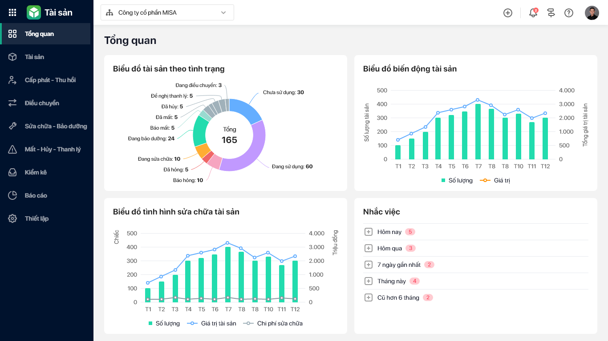

**Description:** Identical to Image 11 - Asset Management Dashboard Overview.

---

### Image 13: Workflow - Run History
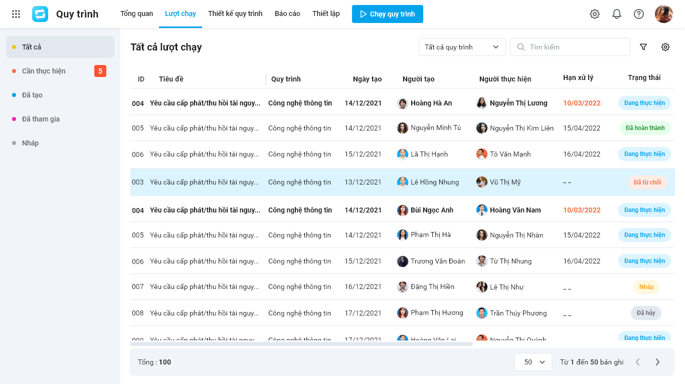

**Description:** Workflow module showing list of all workflow runs (lượt chạy).

**Top Navigation:**
- App: "Quy trình" (Workflow)
- Tabs: Tổng quan (Overview), Lượt chạy (Runs - active), Thiết kế quy trình (Design Workflow), Báo cáo (Reports), Thiết lập (Settings)
- Blue button: "Chạy quy trình" (Run Workflow)

**Left Sidebar:**
- Tất cả (All)
- Cần thực hiện (To Do) - 5 items
- Đã tạo (Created)
- Đã tham gia (Participated)
- Nháp (Draft)

**Main Table - All Runs (Tất cả lượt chạy):**
- Columns: ID, Tiêu đề (Title), Quy trình (Workflow), Ngày tạo (Created Date), Người tạo (Creator), Người thực hiện (Executor), Hạn xử lý (Deadline), Trạng thái (Status)

**Sample Records:**
- ID 004: "Yêu cầu cấp phát/thu hồi tài nguyên CNTT" (IT resource allocation/recovery request) - Đang thực hiện (In progress)
- ID 005: Same type - Đã hoàn thành (Completed)
- ID 006: Same type - Đang thực hiện (In progress)
- ID 003: Same type - Đã từ chối (Rejected)
- ID 004 (Bùi Ngọc Anh): Đang thực hiện (In progress)
- ID 005 (Phạm Thị Hà): Đang thực hiện (In progress)
- ID 006 (Trương Văn Đoàn): Đang thực hiện (In progress)
- ID 007: Nháp (Draft)
- ID 008: Đã hủy (Cancelled)

**Footer:** Tổng: 100 records, 50 per page, Page 1 of 50

---

### Image 14: aiMarketing - Dashboard (Duplicate of Image 09)
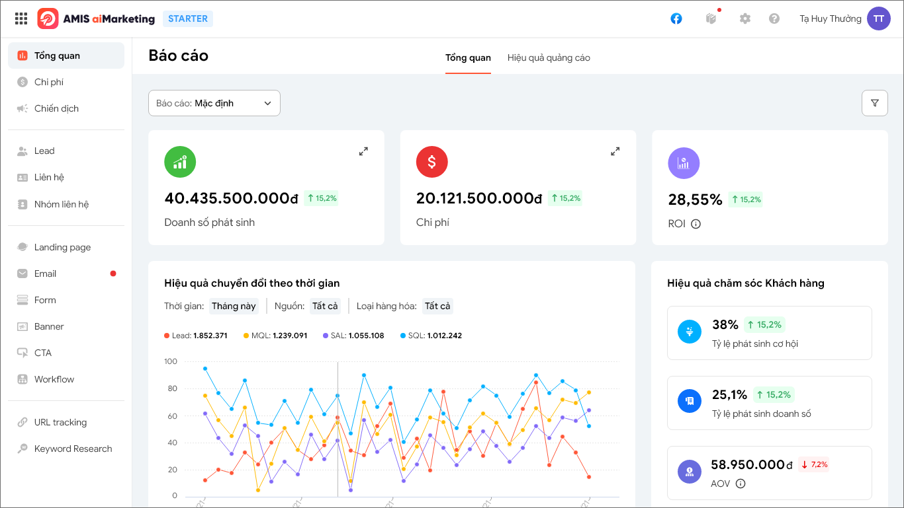

**Description:** Identical to Image 09 - aiMarketing Dashboard with metrics and charts.

---

### Image 15: Accounting - Financial Dashboard
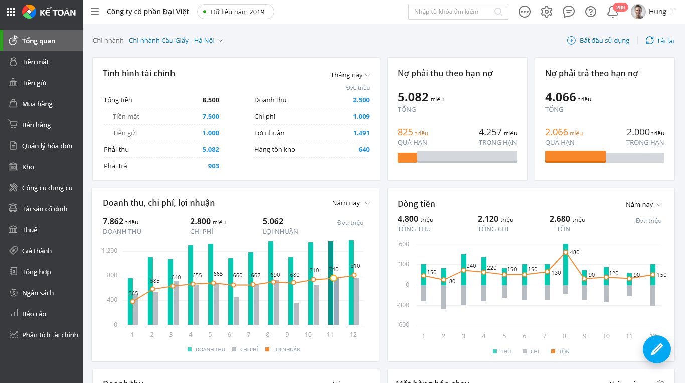

**Description:** Main dashboard of the Accounting (Kế toán) module.

**Top Header:**
- App: "KẾ TOÁN" (Accounting)
- Company: "Công ty cổ phần Đại Việt" (Dai Viet Joint Stock Company)
- Year: "Dữ liệu năm 2019" (Data year 2019)
- Branch: "Chi nhánh Cầu Giấy - Hà Nội" (Cau Giay Branch - Hanoi)

**Left Navigation:**
- Tổng quan (Overview) - Active
- Tiền mặt (Cash)
- Tiền gửi (Deposit)
- Mua hàng (Purchasing)
- Bán hàng (Sales)
- Quản lý hóa đơn (Invoice Management)
- Kho (Warehouse)
- Công cụ dụng cụ (Tools & Equipment)
- Tài sản cố định (Fixed Assets)
- Thuế (Tax)
- Giá thành (Costing)
- Tổng hợp (Summary)
- Ngân sách (Budget)
- Báo cáo (Reports)
- Phân tích tài chính (Financial Analysis)

**Main Dashboard Widgets:**

**1. Financial Status (Tình hình tài chính):**
- Tổng tiền (Total): 8,500
  - Tiền mặt (Cash): 7,500
  - Tiền gửi (Deposit): 1,000
- Phải thu (Receivable): 5,082
- Phải trả (Payable): 903
- Doanh thu (Revenue): 2,500
- Chi phí (Expenses): 1,009
- Lợi nhuận (Profit): 1,491
- Hàng tồn kho (Inventory): 640

**2. Receivables by Due Date (Nợ phải thu theo hạn nợ):**
- TỔNG (Total): 5,082 triệu
- QUÁ HẠN (Overdue): 825 triệu
- TRONG HẠN (Within term): 4,257 triệu

**3. Payables by Due Date (Nợ phải trả theo hạn nợ):**
- TỔNG (Total): 4,066 triệu
- QUÁ HẠN (Overdue): 2,066 triệu
- TRONG HẠN (Within term): 2,000 triệu

**4. Revenue, Expenses, Profit Chart (Doanh thu, chi phí, lợi nhuận):**
- Bar chart showing monthly data
- 3 series: DOANH THU (Revenue - green), CHI PHÍ (Expenses - gray), LỢI NHUẬN (Profit - orange)
- Sample data points: Month 1 (365, 85, -), Month 12 (810, -, -)

**5. Cash Flow Chart (Dòng tiền):**
- Combined bar and line chart
- 3 series: THU (Income - green), CHI (Expense - gray), TỒN (Balance - orange)
- Monthly view for current year

---

### Image 16: Room Booking - Calendar View
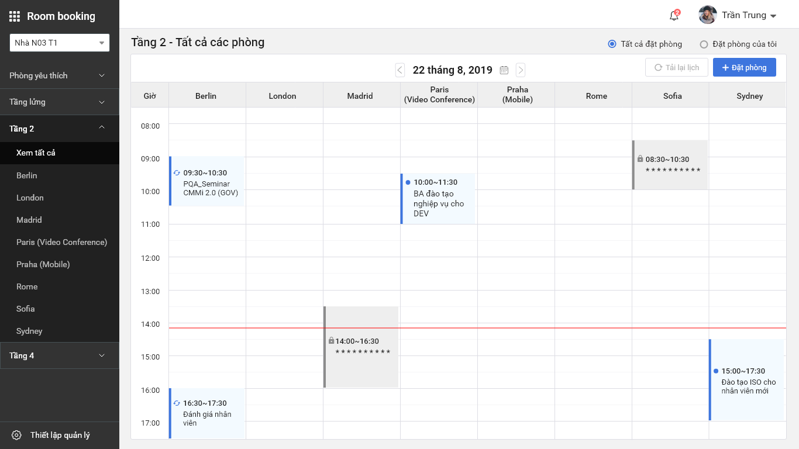

**Description:** Meeting room booking system with calendar grid view.

**Top Header:**
- App: "Room booking"
- Building selector: "Nhà N03 T1"
- User: "Trần Trung"

**Left Navigation:**
- Phòng yêu thích (Favorite rooms)
- Tầng lửng (Mezzanine)
- Tầng 2 (Floor 2) - Expanded
  - Xem tất cả (View all)
  - Berlin
  - London
  - Madrid
  - Paris (Video Conference)
  - Praha (Mobile)
  - Rome
  - Sofia
  - Sydney
- Tầng 4 (Floor 4)
- Thiết lập quản lý (Management Settings)

**Main Calendar Grid:**
- Date: "22 tháng 8, 2019" (August 22, 2019)
- Time slots: 08:00 - 17:00
- Room columns: Berlin, London, Madrid, Paris (Video Conference), Praha (Mobile), Rome, Sofia, Sydney

**Booked Slots:**
- Berlin 09:30-10:30: "PQA_Seminar CMMI 2.0 (GOV)"
- Paris 10:00-11:30: "BA đào tạo nghiệp vụ cho DEV" (BA training for DEV)
- Sofia 08:30-10:30: Locked (private meeting)
- Madrid 14:00-16:30: Locked (private meeting)
- Sydney 15:00-17:30: "Đào tạo ISO cho nhân viên mới" (ISO training for new employees)
- Berlin 16:30-17:30: "Đánh giá nhân viên" (Employee evaluation)

---

### Image 17: Task Management - Dashboard
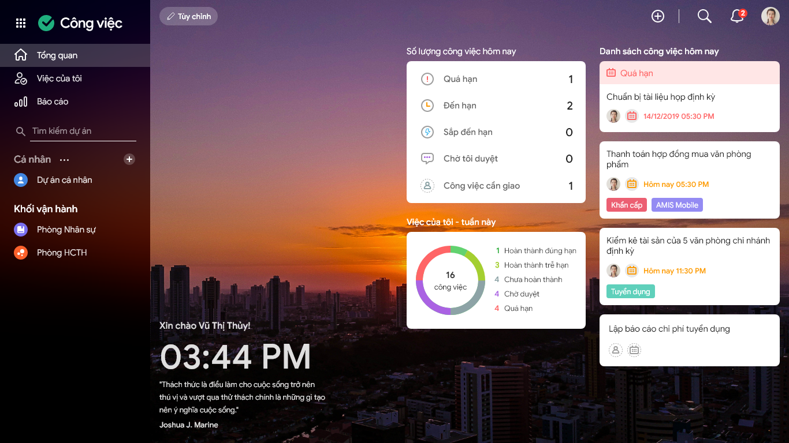

**Description:** Main dashboard of the Task Management (Công việc) module.

**Top Header:**
- App: "Công việc" (Tasks)
- "Tùy chỉnh" (Customize) button

**Left Navigation:**
- Tổng quan (Overview) - Active
- Việc của tôi (My Tasks)
- Báo cáo (Reports)
- Tìm kiếm dự án (Search Projects)
- Cá nhân (Personal) - with + button
  - Dự án cá nhân (Personal Projects)
- Khối vận hành (Operations Block)
  - Phòng Nhân sự (HR Department)
  - Phòng HCTH (Administration Department)

**Main Content (Background: City sunset photo):**

**Greeting:** "Xin chào Vũ Thị Thủy!" (Hello Vu Thi Thuy!)
**Time:** 03:44 PM
**Quote:** "Thách thức là điều làm cho cuộc sống trở nên thú vị và vượt qua thử thách chính là những gì tạo nên ý nghĩa cuộc sống." - Joshua J. Marine

**Task Summary Card (Số lượng công việc hôm nay):**
- Quá hạn (Overdue): 1
- Đến hạn (Due): 2
- Sắp đến hạn (Due Soon): 0
- Chờ tôi duyệt (Awaiting My Approval): 0
- Công việc cần giao (Tasks to Assign): 1

**My Tasks - This Week Card (Việc của tôi - tuần này):**
- Donut chart: 16 tasks total
- 1 Hoàn thành đúng hạn (Completed on time)
- 3 Hoàn thành trễ hạn (Completed late)
- 4 Chưa hoàn thành (Incomplete)
- 4 Chờ duyệt (Pending)
- 4 Quá hạn (Overdue)

**Today's Task List (Danh sách công việc hôm nay):**
1. **Quá hạn (Overdue):** "Chuẩn bị tài liệu họp định kỳ" (Prepare regular meeting documents) - 14/12/2019 05:30 PM
2. **Hôm nay 05:30 PM:** "Thanh toán hợp đồng mua văn phòng phẩm" (Payment for office supplies contract) - Khẩn cấp (Urgent), AMIS Mobile
3. **Hôm nay 11:30 PM:** "Kiểm kê tài sản của 5 văn phòng chi nhánh định kỳ" (Regular asset inventory of 5 branch offices) - Tuyển dụng (Recruitment)
4. **Pending:** "Lập báo cáo chi phí tuyển dụng" (Prepare recruitment cost report)

---

### Image 18: Notes/Documentation - Document Library
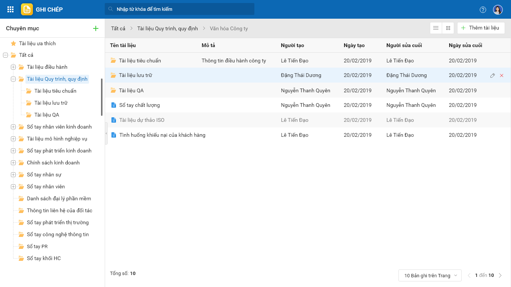

**Description:** Document management module showing company policies and procedures.

**Top Header:**
- App: "GHI CHÉP" (Notes)
- Search: "Nhập từ khóa để tìm kiếm" (Enter keyword to search)

**Breadcrumb:** Tất cả > Tài liệu Quy trình, quy định > Văn hóa Công ty (All > Process Documents, Regulations > Company Culture)

**Left Navigation - Categories:**
- Tài liệu ưa thích (Favorite documents)
- Tất cả (All)
- Tài liệu điều hành (Management documents)
- Tài liệu Quy trình, quy định (Process documents, regulations) - Expanded
  - Tài liệu tiêu chuẩn (Standard documents)
  - Tài liệu lưu trữ (Archive documents)
  - Tài liệu QA (QA documents)
- Sổ tay nhân viên kinh doanh (Sales employee handbook)
- Tài liệu mô hình nghiệp vụ (Business model documents)
- Chính sách kinh doanh (Business policies)
- Sổ tay nhân sự (HR handbook)
- Sổ tay nhân viên (Employee handbook)
- Danh sách đại lý phần mềm (Software dealer list)
- Thông tin liên hệ của đối tác (Partner contact info)
- Sổ tay phát triển thị trường (Market development handbook)
- Sổ tay công nghệ thông tin (IT handbook)
- Sổ tay PR (PR handbook)
- Sổ tay khối HC (Admin block handbook)

**Main Document List:**
Columns: Tên tài liệu (Document name), Mô tả (Description), Người tạo (Creator), Ngày tạo (Created date), Người sửa cuối (Last editor), Ngày sửa cuối (Last edited date)

**Documents:**
1. Tài liệu tiêu chuẩn - "Thông tin điều hành công ty" - Lê Tiến Đạo - 20/02/2019
2. Tài liệu lưu trữ - Đặng Thái Dương - 20/02/2019
3. Tài liệu QA - Nguyễn Thanh Quyên - 20/02/2019
4. Sổ tay chất lượng (Quality handbook) - Nguyễn Thanh Quyên - 20/02/2019
5. Tài liệu dự thảo ISO (ISO draft document) - Lê Tiến Đạo - 20/02/2019
6. Tình huống khiếu nại của khách hàng (Customer complaint scenarios) - Lê Tiến Đạo - 20/02/2019

**Footer:** Tổng số: 10 documents, 10 records per page

---

### Image 19: Internal Social Network - Feed

**Description:** Internal social network feed similar to Facebook-style interface.

**Top Header:**
- App: "Mạng xã hội" (Social Network)
- Search: "Tìm kiếm tin tức, chia sẻ..." (Search news, shares...)
- Right: Trang cá nhân (Profile), Add, Settings, Notification, Help, User avatar

**Left Navigation:**
- Bảng tin (News Feed) - Active
- Tin tức (News)
- Ao cơ hội (Opportunity pool)
- Sáng kiến (Ideas)

**Main Feed:**
- Post composer: "Bạn muốn chia sẻ điều gì?" (What do you want to share?)
- Quick actions: Chia sẻ (Share), Sáng kiến (Ideas), Tin tức (News)

**Sample Post:**
- Author: Đặng Thùy Anh (30 phút trước - 30 minutes ago)
- Content: "Teambuilding với Misa những ngày cuối mùa thu that là tuyệt vời và nhiều ý nghĩa. Chúc gia đình MISA ngày một lớn mạnh và trưởng thành vững chắc!" (Teambuilding with Misa in the last days of autumn is wonderful and meaningful. Wishing MISA family to grow stronger and more mature!)
- Image: Beach photo with couple
- Additional images in grid below

**Right Sidebar:**
- **Sinh nhật (Birthdays):**
  - Hoàng Trung Kiên - Tròn 27 tuổi (Turning 27)
  - Nguyễn Hạnh Nguyên - Tròn 23 tuổi (Turning 23)
  - Hoàng Hải Nam - Tròn 24 tuổi (Turning 24)

- **Thông báo (Notifications):**
  - Đặng Minh Vân, Phạm Quốc Huỳnh vừa gia nhập công ty (joined company)
  - Đào Quỳnh Thu được khen thưởng (received commendation)
  - Chị Nguyễn Thị Thu được bổ nhiệm vào vị trí mới (promoted to new position)
  - Phạm Duy Kiên vừa kết hôn ngày 16/03/2018 (married)
  - Phạm Quốc Nam vừa nghỉ việc (resigned)
  - Anh Nguyễn Đình Sơn vừa thuyên chuyển sang vị trí mới (transferred to new position)
  - Chị Trần Ngọc Huyền vừa gia nhập công ty (joined company)

---

### Image 20: Payroll - Dashboard Overview

**Description:** Main dashboard of the Payroll (Tiền lương) module.

**Top Header:**
- App: "P Tiền lương" (Payroll)
- Tabs: Tổng quan (Overview - active), Thành phần lương (Salary Components), Chính sách (Policy), Dữ liệu tính lương (Payroll Data), Tính lương (Calculate Payroll), Chi trả lương (Pay Salary), Báo cáo (Reports)

**Greeting:** "Chào Vũ Ngọc Sim, Bạn đang xem dữ liệu tổng quan về tiền lương của Công ty cổ phần Phạm Gia Golden." (Hello Vu Ngoc Sim, you are viewing payroll overview data of Pham Gia Golden Joint Stock Company.)

**Top Summary Cards:**
- **Tổng hợp lương** (Salary Summary) - Văn phòng Hà Nội - Tháng này (Hanoi Office - This month)
  - TỔNG LƯƠNG (Total Salary): 1,250 Triệu đồng (Billion VND)
  - THUẾ TNCN (PIT): 50 Triệu đồng
  - BẢO HIỂM (Insurance): 50 Triệu đồng

**Main Dashboard Widgets:**

**1. Employee Salary Level Analysis (Phân tích mức lương nhân viên):**
- Horizontal bar chart showing salary ranges
- Trên 30 (Above 30M): 50 employees
- Từ 20 đến 30 (20-30M): ~150 employees
- Từ 10 đến 20 (10-20M): ~200 employees
- Nhỏ hơn 10 (Below 10M): ~150 employees

**2. Income Structure (Cơ cấu thu nhập):**
- Donut chart showing salary components:
  - Lương cơ bản (Base Salary): 54.6%
  - Thưởng doanh số (Sales Bonus): 28.6%
  - Thưởng kicker (Kicker Bonus): 14.3%
  - Thưởng NVXS (Excellent Employee Bonus): 1.8%
  - Hiếu/Hỷ/Sinh nhật (Sympathy/Celebration/Birthday): 0.7%

**3. Average Income Over Time (Thu nhập bình quân theo thời gian):**
- Line chart showing monthly average income
- T1-T6 (Months 1-6)
- Tooltip: Tháng 8: 15,000,000

**4. Average Income by Unit (Thu nhập bình quân theo đơn vị):**
- Bar chart by office location:
  - VP HN (Hanoi Office): ~18M
  - VP HCM (HCM Office): ~14M
  - VP CT (Can Tho Office): 15,000,000
  - VP BMT (Buon Ma Thuot Office): ~11M
  - VP DN (Da Nang Office): ~10M

**Right Sidebar:**

**Payslip Feedback (Phản hồi phiếu lương):**
- Bảng lương tháng 11 - 2020 (November 2020 Payslip)
- Two groups with employee avatars
- "Chi tiết" (Details) links

**Reminders (Lời nhắc):**
- CHƯA GỬI PHIẾU LƯƠNG (Payslip not sent) - 2 items
- NHÂN VIÊN CHƯA THAM GIA BHXH (Employees not enrolled in Social Insurance):
  - Trịnh Phương Anh - Phòng kinh doanh Sofia
  - Đoàn Ngọc Minh Anh - Phòng kinh doanh Sofia
- LƯƠNG ĐÓNG BH NGOÀI QUY ĐỊNH (Irregular Insurance Salary)

---

### Image 21: Time Tracking - Timesheet
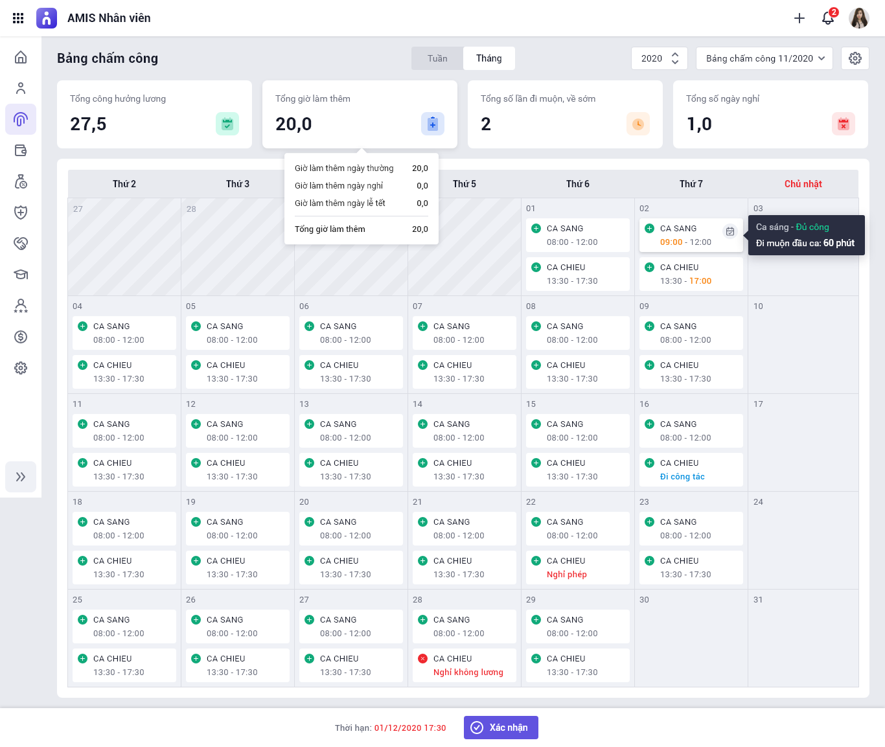

**Description:** Time and attendance tracking calendar showing employee work schedule.

**Top Header:**
- App: "AMIS Nhân viên" (AMIS Employee)
- Title: "Bảng chấm công" (Timesheet)
- Toggle: Tuần (Week) / Tháng (Month) - Month selected
- Year: 2020
- Selector: "Bảng chấm công 11/2020" (November 2020 Timesheet)

**Summary Cards:**
- Tổng công hưởng lương (Paid working days): 27.5
- Tổng giờ làm thêm (Total overtime): 20.0 hours
- Tổng số lần đi muộn, về sớm (Late/Early leave count): 2
- Tổng số ngày nghỉ (Total leave days): 1.0

**Calendar Grid (November 2020):**
- Days: Thứ 2 (Mon) through Chủ nhật (Sun)
- Each day shows shift blocks:
  - CA SÁNG (Morning shift): 08:00 - 12:00
  - CA CHIỀU (Afternoon shift): 13:30 - 17:30

**Special Markers:**
- Nov 22: CA CHIỀU - Nghỉ phép (Leave)
- Nov 29: CA CHIỀU - Nghỉ không lương (Unpaid leave)
- Nov 16: CA CHIỀU - Đi công tác (Business trip)
- Nov 3: Tooltip showing "Ca sáng - Đủ công, Đi muộn đầu ca: 60 phút" (Morning shift - Full day, Late arrival: 60 minutes)

**Overtime Popup (hovering over Nov 5):**
- Giờ làm thêm ngày thường (Regular day overtime): 20.0
- Giờ làm thêm ngày nghỉ (Rest day overtime): 0.0
- Giờ làm thêm ngày lễ tết (Holiday overtime): 0.0
- Tổng giờ làm thêm (Total overtime): 20.0

**Bottom:** Deadline: 01/12/2020 17:30, Button: "Xác nhận" (Confirm)

---

### Image 22: Task Processing in Chat - Marketing Graphic
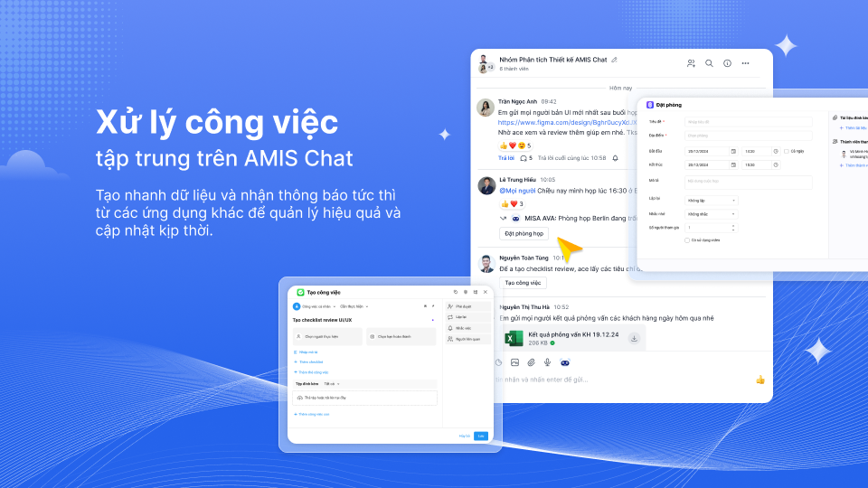

**Description:** Marketing graphic showcasing task management integration within AMIS Chat.

**Main Title:** "Xử lý công việc tập trung trên AMIS Chat" (Centralized Task Processing on AMIS Chat)

**Subtitle:** "Tạo nhanh dữ liệu và nhận thông báo tức thì từ các ứng dụng khác để quản lý hiệu quả và cập nhật kịp thời." (Quickly create data and receive instant notifications from other applications for effective management and timely updates.)

**Chat Window Screenshot:**
- Group: "Nhóm Phân tích Thiết kế AMIS Chat" (AMIS Chat Design Analysis Group) - 8 thành viên (members)
- Messages showing team collaboration:
  - Thảo Ngọc Anh: Sending Figma design link for review
  - Lê Trung Hiếu: Mentioning @Chiệu about meeting at 16:30
  - MISA AVA: Auto-notification "Phòng họp Berlin đang trống" (Berlin meeting room is available)
  - Nguyễn Toàn Tùng: Creating checklist for review
  - Nguyễn Thị Thu Hà: Sending meeting results Excel file

**Task Creation Overlay:**
- Popup showing task creation form
- Title: "Tạo checklist review UI/UX"
- Fields: Assignee, Due date, Priority
- Subtasks: Thiết kế UI, Thiết kế UX, Kiểm thử chức năng

---

### Image 23: Video Library - Add Video Modal
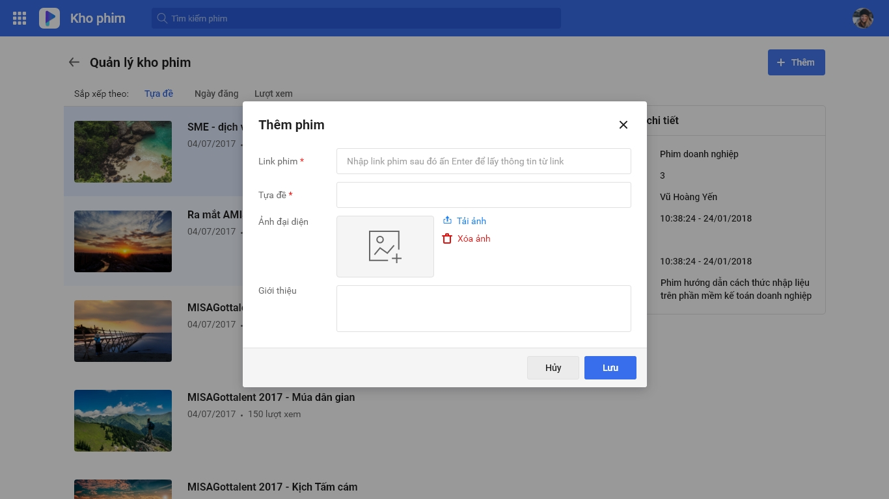

**Description:** Video library module with "Add Video" modal dialog.

**Top Header:**
- App: "Kho phim" (Video Library)
- Search: "Tìm kiếm phim" (Search videos)

**Page Title:** "Quản lý kho phim" (Video Library Management)

**Sort Options:** Sắp xếp theo (Sort by): Tựa đề (Title), Ngày đăng (Upload date), Lượt xem (Views)

**Add Video Modal (Thêm phim):**
- Link phim (Video link) - with hint "Nhập link phim sau đó ấn Enter để lấy thông tin từ link" (Enter video link then press Enter to fetch info)
- Tựa đề (Title)
- Ảnh đại diện (Thumbnail) - Upload/Delete options
- Giới thiệu (Description)
- Buttons: Hủy (Cancel), Lưu (Save)

**Background Video List:**
- SME - dịch vụ... (04/07/2017)
- Ra mắt AMIS... (04/07/2017)
- MISAGottalent 2017 - Múa dân gian (04/07/2017 - 150 views)
- MISAGottalent 2017 - Kịch Tấm cám

---

### Image 24: Photo Library - Photo Viewer

**Description:** Photo library viewer showing a beach/rock formation aerial photo with social interaction features.

**Top Header:**
- App: "Kho ảnh" (Photo Library)
- Search: "Tìm kiếm ảnh" (Search photos)

**Main Photo:**
- Aerial view of rocky coastline with turquoise water and sandy beach
- Navigation arrows (left/right) for browsing

**Right Panel - Photo Details:**
- Uploader: Đặng Thu Trang
- Upload date: 04/07/2017
- Engagement: 17 Thích (Likes), 34 Bình luận (Comments), 5 Chia sẻ (Shares)

**Comments Section:**
- Đặng Thu Trang: "Ảnh đẹp quá" (Beautiful photo) - 3 ngày trước
- Vũ Hoàng Yến: "Tuyệt vời, nghệ thuật quá" (Excellent, so artistic) - 3 ngày trước
- Phạm Thị Ánh Vân: "Ảnh này quá tuyệt" (This photo is amazing) - 3 ngày trước

**Bottom:** Comment input: "Nhập bình luận và bấm Enter" (Enter comment and press Enter)

---

### Image 25: Accounting - Workflow Dashboard
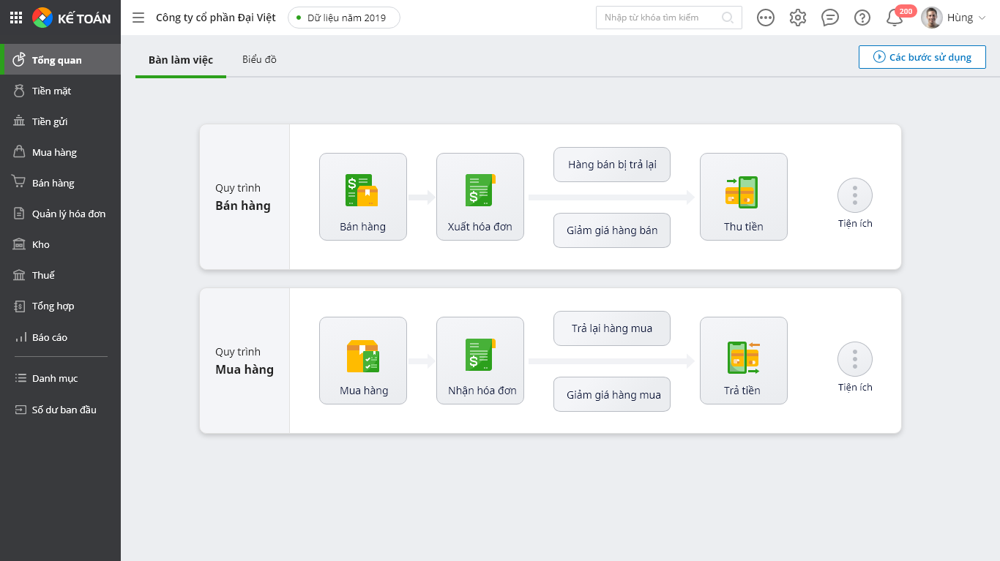

**Description:** Accounting module main dashboard showing sales and purchasing workflow diagrams.

**Left Navigation:** Same as Image 15 (Accounting module navigation)

**Main Content - Process Workflows:**

**1. Sales Process (Quy trình Bán hàng):**
- Flow: Bán hàng (Sales) → Xuất hóa đơn (Issue Invoice) → Thu tiền (Collect Payment)
- Side options: Hàng bán bị trả lại (Sales returns), Giảm giá hàng bán (Sales discount)
- Utilities button (Tiện ích)

**2. Purchasing Process (Quy trình Mua hàng):**
- Flow: Mua hàng (Purchase) → Nhận hóa đơn (Receive Invoice) → Trả tiền (Make Payment)
- Side options: Trả lại hàng mua (Purchase returns), Giảm giá hàng mua (Purchase discount)
- Utilities button (Tiện ích)

---

### Image 26: Digital Signature - Certificate Management
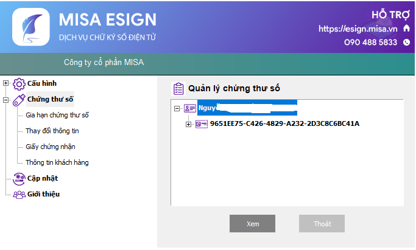

**Description:** MISA ESign digital signature certificate management interface.

**Header:**
- Logo: "MISA ESIGN - DỊCH VỤ CHỮ KÝ SỐ ĐIỆN TỬ" (Digital Signature Service)
- Company: "Công ty cổ phần MISA"
- Support: https://esign.misa.vn, Phone: 090 488 5833

**Left Navigation:**
- Cấu hình (Configuration)
- Chứng thư số (Digital Certificate) - Active
  - Gia hạn chứng thư số (Renew certificate)
  - Thay đổi thông tin (Change information)
  - Giấy chứng nhận (Certificate)
  - Thông tin khách hàng (Customer information)
- Cập nhật (Update)
- Giới thiệu (Introduction)

**Main Content:**
- Title: "Quản lý chứng thư số" (Certificate Management)
- Certificate tree showing:
  - Nguyễn [blurred]
  - Certificate ID: 9651EE75-C426-4829-A232-2D3C8C6BC41A
- Buttons: Xem (View), Thoát (Exit)

---

### Image 27: Payment Gateway - JetPay Dashboard
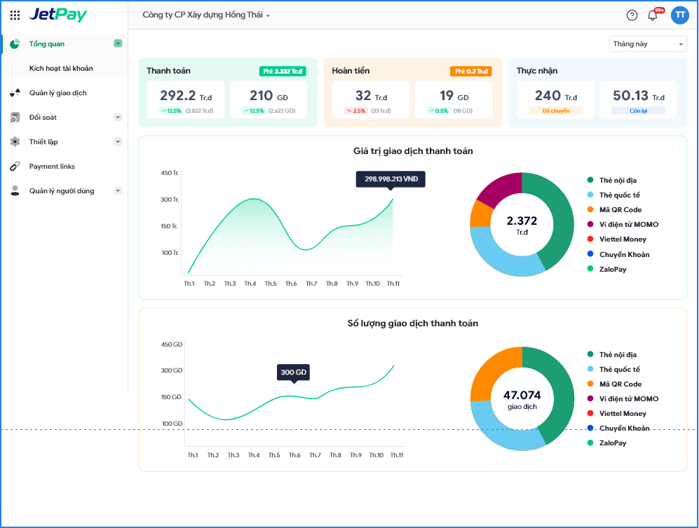

**Description:** JetPay payment gateway dashboard with transaction analytics.

**Header:**
- Logo: "JetPay"
- Company: "Công ty CP Xây dựng Hồng Thái" (Hong Thai Construction JSC)
- Month selector: Tháng này (This month)

**Left Navigation:**
- Tổng quan (Overview) - Active
- Kích hoạt tài khoản (Account Activation)
- Quản lý giao dịch (Transaction Management)
- Đối soát (Reconciliation)
- Thiết lập (Settings)
- Payment links
- Quản lý người dùng (User Management)

**Top Summary Cards:**
1. **Thanh toán (Payments):**
   - 292.2 Tr.đ (2,822 Tr.đ total) ↑12.5%
   - 210 GD (2,622 GD total) ↑12.5%
   - Fee: 3.332 Tr.đ

2. **Hoàn tiền (Refunds):**
   - 32 Tr.đ (33 Tr.đ total) ↓2.5%
   - 19 GD (18 GD total) ↑0.5%
   - Fee: 0.2 Tr.đ

3. **Thực nhận (Net Received):**
   - 240 Tr.đ (Đã chuyển - Transferred)
   - 50.13 Tr.đ (Còn lại - Remaining)

**Chart 1 - Payment Transaction Value (Giá trị giao dịch thanh toán):**
- Area chart showing monthly trend
- Tooltip: 298,998,213 VND
- Monthly progression Th.1 - Th.11

**Pie Chart - Payment Methods:**
- Total: 2,372 Tr.đ
- Methods: Thẻ nội địa (Domestic card), Thẻ quốc tế (International card), Mã QR Code (QR Code), Ví điện tử MOMO (MOMO e-wallet), Viettel Money, Chuyển Khoản (Transfer), ZaloPay

**Chart 2 - Payment Transaction Count (Số lượng giao dịch thanh toán):**
- Area chart showing monthly transaction count
- Tooltip: 300 GD

**Pie Chart - Transaction Count by Method:**
- Total: 47,074 giao dịch (transactions)
- Same payment method breakdown

---

### Image 28: E-Invoice Management Dashboard
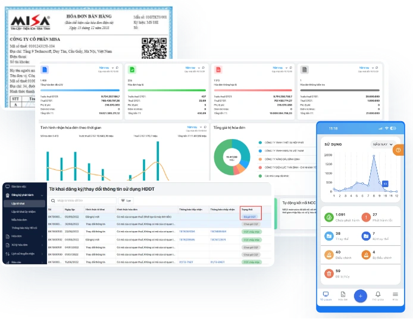

**Description:** E-invoice management dashboard with multiple views and analytics.

**Top Section:**
- Sample e-invoice with QR code
- Dashboard with multiple KPI cards and charts

**KPI Cards:**
- Various invoice statistics with numbers and trends

**Charts:**
- Bar chart: Invoice timeline over time
- Pie chart: Invoice value by category
- Mobile app screenshot showing invoice usage statistics

**Main Table:**
- List of tax period declarations
- Columns: STT, Period, Tax code, Status, Submission date
- Status indicators: Đã nộp (Submitted), Chưa nộp (Not submitted)

**Mobile App Preview:**
- Usage statistics: 1,091 times used, 27 invoices this month
- Pie charts for usage categories

---

### Image 29: Cooperative Accounting - Purchasing Dashboard
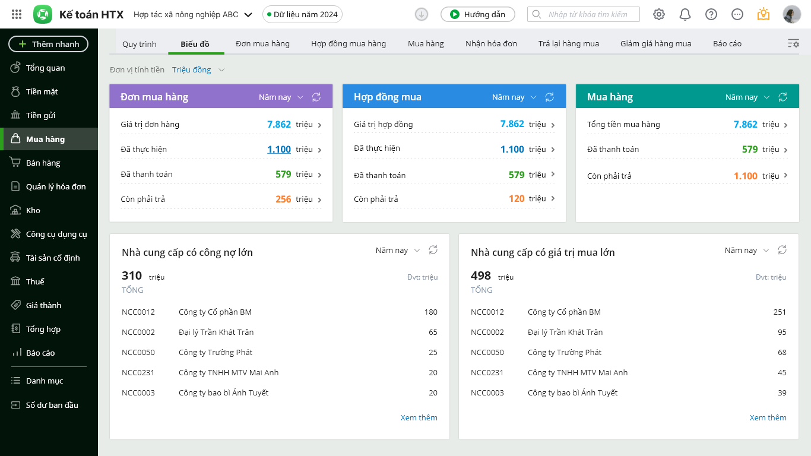

**Description:** Cooperative accounting (Kế toán HTX) module showing purchasing dashboard.

**Top Header:**
- App: "Kế toán HTX" (Cooperative Accounting)
- Company: "Hợp tác xã nông nghiệp ABC" (ABC Agricultural Cooperative)
- Year: "Dữ liệu năm 2024" (Data year 2024)
- Tab: Biểu đồ (Charts) - active

**Left Navigation:** Same accounting structure as Image 15

**Main Dashboard - Purchasing View (Mua hàng):**

**Top Cards:**
1. **Đơn mua hàng (Purchase Orders):**
   - Giá trị đơn hàng (Order value): 7,862 triệu
   - Đã thực hiện (Executed): 1,100 triệu
   - Đã thanh toán (Paid): 579 triệu
   - Còn phải trả (Remaining payable): 256 triệu

2. **Hợp đồng mua (Purchase Contracts):**
   - Giá trị hợp đồng (Contract value): 7,862 triệu
   - Đã thực hiện (Executed): 1,100 triệu
   - Đã thanh toán (Paid): 579 triệu
   - Còn phải trả (Remaining payable): 120 triệu

3. **Mua hàng (Purchases):**
   - Tổng tiền mua hàng (Total purchase): 7,862 triệu
   - Đã thanh toán (Paid): 579 triệu
   - Còn phải trả (Remaining payable): 1,100 triệu

**Bottom Tables:**

**Suppliers with Large Debts (Nhà cung cấp có công nợ lớn):**
- Total: 310 triệu
- Top suppliers: NCC0012 (180), NCC0002 (65), NCC0050 (25), etc.

**Suppliers with Large Purchase Values (Nhà cung cấp có giá trị mua lớn):**
- Total: 498 triệu
- Top suppliers: NCC0012 (251), NCC0002 (95), NCC0050 (68), etc.

---

### Image 30: Group Management - Data Management
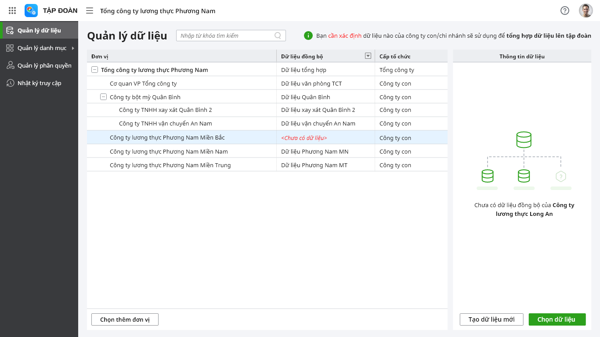

**Description:** Group management module for managing data across subsidiary companies.

**Top Header:**
- App: "TẬP ĐOÀN" (Group)
- Company: "Tổng công ty lương thực Phương Nam" (Phuong Nam Food Corporation)

**Left Navigation:**
- Quản lý dữ liệu (Data Management) - Active
- Quản lý danh mục (Category Management)
- Quản lý phân quyền (Permission Management)
- Nhật ký truy cập (Access Log)

**Main Content - Data Management:**
- Title: "Quản lý dữ liệu" (Data Management)
- Info notice: "Bạn cần xác định dữ liệu nào của công ty con/chi nhánh sẽ sử dụng để tổng hợp dữ liệu lên tập đoàn" (You need to determine which subsidiary/branch data will be used for group consolidation)

**Table Columns:**
- Đơn vị (Unit)
- Dữ liệu đồng bộ (Synced Data)
- Cấp tổ chức (Organization Level)

**Organizational Structure:**
- Tổng công ty lương thực Phương Nam - Dữ liệu tổng hợp (Consolidated data) - Tổng công ty (Corporation)
  - Cơ quan VP Tổng công ty - Dữ liệu văn phòng TCT (Head office data)
  - Công ty bột mì Quân Bình - Dữ liệu Quân Bình - Công ty con (Subsidiary)
  - Công ty TNHH xay xát Quân Bình 2 - Dữ liệu xay xát Quân Bình 2 - Công ty con
  - Công ty TNHH vận chuyển An Nam - Dữ liệu vận chuyển An Nam - Công ty con
  - Công ty lương thực Phương Nam Miền Bắc - <Chưa có dữ liệu> (No data yet) - Công ty con
  - Công ty lương thực Phương Nam Miền Nam - Dữ liệu Phương Nam MN - Công ty con
  - Công ty lương thực Phương Nam Miền Trung - Dữ liệu Phương Nam MT - Công ty con

**Right Panel:**
- Database icon diagram showing data hierarchy
- Notice: "Chưa có dữ liệu đồng bộ của Công ty lương thực Long An" (No synced data from Long An Food Company)
- Buttons: Tạo dữ liệu mới (Create new data), Chọn dữ liệu (Select data)

---

### Image 31: aiMarketing - Dashboard (Duplicate)

**Description:** Identical to Image 09 and Image 14 - aiMarketing Dashboard.

---

### Image 32: aiMarketing - Dashboard (Duplicate)

**Description:** Identical to Image 09, 14, and 31 - aiMarketing Dashboard.

---

### Image 33: Promotion Management - Analysis Report
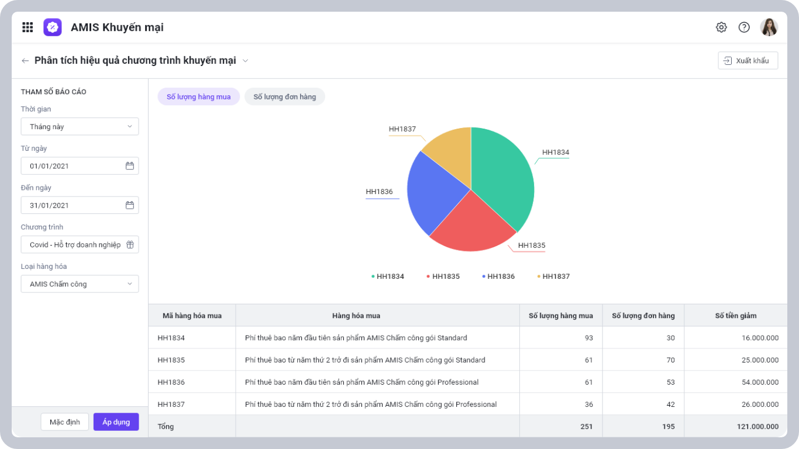

**Description:** Promotion management module showing promotion program effectiveness analysis.

**Header:**
- App: "AMIS Khuyến mại" (AMIS Promotion)
- Title: "Phân tích hiệu quả chương trình khuyến mại" (Promotion Program Effectiveness Analysis)

**Left Filter Panel (Tham số báo cáo - Report Parameters):**
- Thời gian (Time): Tháng này (This month)
- Từ ngày (From date): 01/01/2021
- Đến ngày (To date): 31/01/2021
- Chương trình (Program): Covid - Hỗ trợ doanh nghiệp (Covid - Business Support)
- Loại hàng hóa (Product type): AMIS Chấm công (AMIS Time Tracking)

**Main Content:**
- Toggle: Số lượng hàng mua (Purchase quantity) / Số lượng đơn hàng (Order quantity)
- Pie chart showing product distribution: HH1834, HH1835, HH1836, HH1837

**Data Table:**
Columns: Mã hàng hóa mua (Product code), Hàng hóa mua (Product name), Số lượng hàng mua (Purchase quantity), Số lượng đơn hàng (Order count), Số tiền giảm (Discount amount)

**Rows:**
- HH1834: First year subscription fee AMIS Time Tracking Standard - 93 units, 30 orders, 16,000,000 discount
- HH1835: Second year+ subscription fee Standard - 61 units, 70 orders, 25,000,000 discount
- HH1836: First year subscription fee Professional - 61 units, 53 orders, 54,000,000 discount
- HH1837: Second year+ subscription fee Professional - 36 units, 42 orders, 26,000,000 discount
- **Total: 251 units, 195 orders, 121,000,000 discount**

---

### Image 34: Retail Store POS System
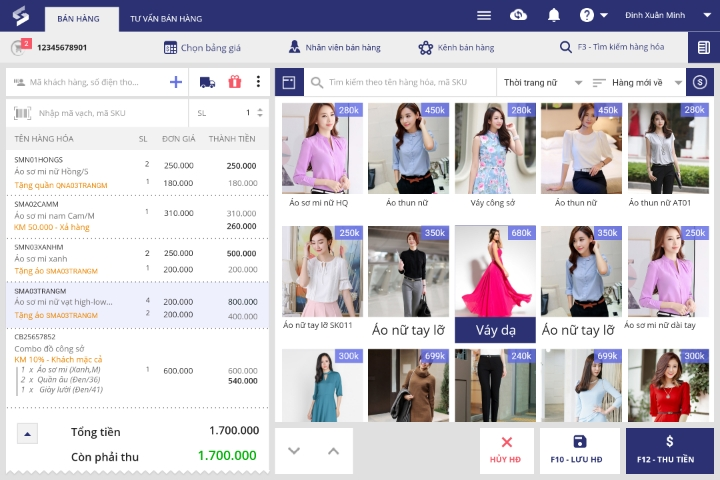

**Description:** Point of Sale (POS) interface for retail store operations.

**Header:**
- Tab: BÁN HÀNG (Sales)
- Phone number: 12345678901
- Actions: Chọn bảng giá (Select price list), Nhân viên bán hàng (Sales staff), Kênh bán hàng (Sales channel)
- User: Đinh Xuân Minh
- Search: F3 - Tìm kiếm hàng hóa (Search products)

**Left Panel - Shopping Cart:**
- Customer info: Mã khách hàng (Customer code), Số điện thoại (Phone)
- Product list with quantities, unit prices, and totals
- Sample items:
  - Áo sơ mi nam Hồng S/2: 2 × 250,000 = 250,000
  - Áo sơ mi nam Cam/M: 1 × 310,000 = 310,000
  - Áo sơ mi nữ vàng: 2 × 250,000 = 260,000
  - Áo sơ mi nữ vàng high-low: 4 × 200,000 = 800,000
- Total: 1,700,000
- Remaining payment: 1,700,000

**Right Panel - Product Grid:**
- Category filters: Thời trang nữ (Women's fashion), Hàng mới về (New arrivals)
- Product cards with images, names, and prices:
  - Áo sơ mi nữ HQ: 280k
  - Áo thun nữ: 450k
  - Váy công sở: 280k
  - Váy dạ: 680k
  - Various other items with prices

**Bottom Action Buttons:**
- HỦY HĐ (Cancel Invoice)
- F10 - LƯU HĐ (Save Invoice)
- F12 - THU TIỀN (Collect Payment)

---

### Image 35: HR Information - Employee Database
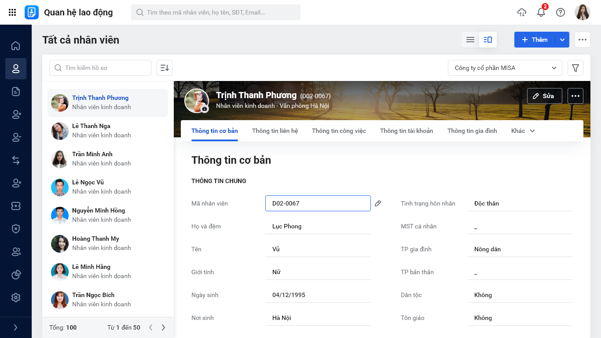

**Description:** HR employee information module showing employee list and detail view.

**Top Header:**
- App: "Quan hệ lao động" (Labor Relations)
- Search: "Tìm theo mã nhân viên, họ tên, SDT, Email..." (Search by employee ID, name, phone, email)

**Left Navigation:**
- Employee list with photos and names:
  - Trịnh Thanh Phương - Nhân viên kinh doanh (Sales staff)
  - Lê Thanh Nga - Nhân viên kinh doanh
  - Trần Minh Anh - Nhân viên kinh doanh
  - Lê Ngọc Vũ - Nhân viên kinh doanh
  - Nguyễn Minh Hồng - Nhân viên kinh doanh
  - Hoàng Thanh My - Nhân viên kinh doanh
  - Lê Minh Hằng - Nhân viên kinh doanh
  - Trần Ngọc Bích - Nhân viên kinh doanh

**Main Content - Employee Detail:**

**Header:**
- Employee: Trịnh Thanh Phương (D02-0067)
- Position: Nhân viên kinh doanh - Văn phòng Hà Nội (Sales staff - Hanoi Office)
- Actions: Sửa (Edit), More options

**Tabs:**
- Thông tin cơ bản (Basic Information) - Active
- Thông tin liên hệ (Contact Information)
- Thông tin công việc (Work Information)
- Thông tin tài khoản (Account Information)
- Thông tin gia đình (Family Information)
- Khác (Other)

**Basic Information Form:**
- Mã nhân viên (Employee ID): D02-0067
- Họ và đệm (Middle name): Lục Phong
- Tên (Last name): Vũ
- Giới tính (Gender): Nữ (Female)
- Ngày sinh (Date of Birth): 04/12/1995
- Nơi sinh (Place of Birth): Hà Nội
- Tình trạng hôn nhân (Marital Status): Độc thân (Single)
- MST cá nhân (Personal Tax ID): -
- TP gia đình (Family Type): Nông dân (Farmer)
- TP bản thân (Self Type): -
- Dân tộc (Ethnicity): Không (None)
- Tôn giáo (Religion): Không (None)

**Footer:** Tổng: 100 employees, Showing 1-50

---

### Image 36: Recruitment - Candidate Pipeline
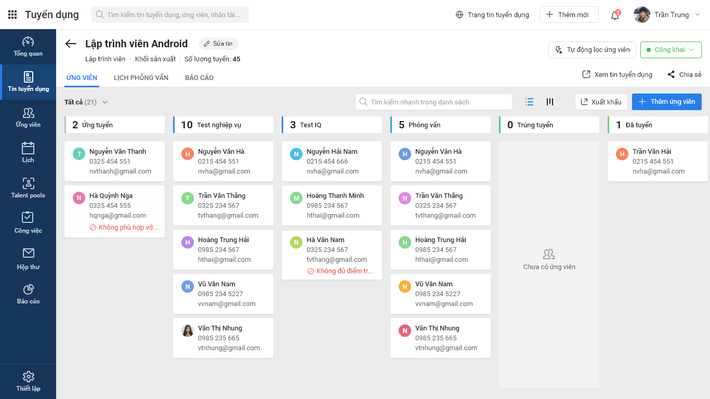

**Description:** Recruitment module showing candidate pipeline for Android Developer position.

**Top Header:**
- App: "Tuyển dụng" (Recruitment)
- Search bar
- Job posting page link, Add new, User: Trần Trung

**Left Navigation:**
- Tổng quan (Overview)
- Tin tuyển dụng (Job Postings) - Active
- Ứng viên (Candidates)
- Lịch (Calendar)
- Talent pools
- Công việc (Tasks)
- Hộp thư (Inbox)
- Báo cáo (Reports)
- Thiết lập (Settings)

**Main Content - Job Detail:**
- Job title: "Lập trình viên Android" (Android Developer)
- Department: Lập trình viên · Khối sản xuất
- Headcount: 45
- Tabs: ỨNG VIÊN (Candidates - active), LỊCH PHỎNG VẤN (Interview Schedule), BÁO CÁO (Reports)

**Pipeline Stages (Kanban Board):**
1. **Ứng tuyển (Applied):** 2 candidates
   - Nguyễn Văn Thanh, Hà Quỳnh Nga (marked as not suitable)

2. **Test nghiệp vụ (Skills Test):** 10 candidates
   - Nguyễn Văn Hà, Trần Văn Thắng, Hoàng Thanh Minh, Vũ Văn Nam, Văn Thị Nhung, etc.

3. **Test IQ:** 3 candidates
   - Nguyễn Hải Nam (marked as insufficient score)

4. **Phỏng vấn (Interview):** 5 candidates
   - Nguyễn Văn Hà, Trần Văn Thắng, Hoàng Trung Hải, Vũ Văn Nam, Văn Thị Nhung

5. **Trúng tuyển (Hired):** 0 candidates

6. **Đã tuyển (Recruited):** 1 candidate
   - Trần Văn Hải

**Top Actions:** Tự động lọc ứng viên (Auto-filter candidates), Công khai (Public)

---

### Image 37: HR Overview - Dashboard
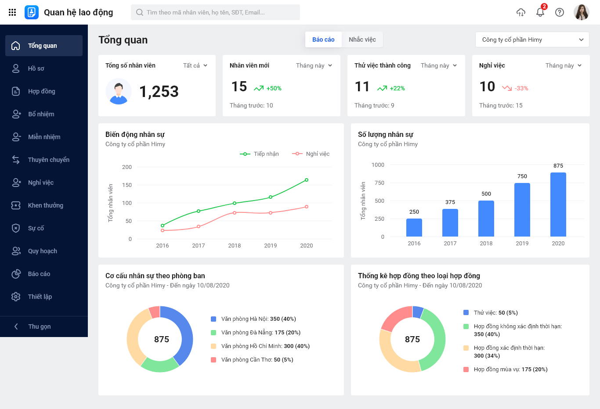

**Description:** HR overview dashboard with key metrics and charts.

**Top Header:**
- App: "Quan hệ lao động" (Labor Relations)
- Title: Tổng quan (Overview)
- Toggle: Báo cáo (Reports) / Nhắc việc (Reminders)

**Left Navigation:**
- Tổng quan (Overview) - Active
- Hồ sơ (Profiles)
- Hợp đồng (Contracts)
- Bổ nhiệm (Appointments)
- Miễn nhiệm (Dismissals)
- Thuyên chuyển (Transfers)
- Nghỉ việc (Resignations)
- Khen thưởng (Commendations)
- Sự cố (Incidents)
- Quy hoạch (Planning)
- Báo cáo (Reports)
- Thiết lập (Settings)

**Top Summary Cards:**
1. **Tổng số nhân viên (Total employees):** 1,253
2. **Nhân viên mới (New employees):** 15 this month ↑+50% (Last month: 10)
3. **Thử việc thành công (Successful probation):** 11 this month ↑+22% (Last month: 9)
4. **Nghỉ việc (Resignations):** 10 this month ↓-33% (Last month: 15)

**Charts:**

**1. HR Movement (Biến động nhân sự):**
- Line chart 2016-2020
- Green line: Tiếp nhận (Hiring) - increasing trend
- Red line: Nghỉ việc (Resignation) - stable then slight increase

**2. Employee Count (Số lượng nhân sự):**
- Bar chart 2016-2020
- 2016: 250 → 2020: 875

**3. Department Structure (Cơ cấu nhân sự theo phòng ban):**
- Donut chart showing 875 employees
- Văn phòng Hà Nội: 350 (40%)
- Văn phòng Đà Nẵng: 175 (20%)
- Văn phòng Hồ Chí Minh: 300 (40%)
- Văn phòng Cần Thơ: 50 (5%)

**4. Contract Statistics (Thống kê hợp đồng theo loại hợp đồng):**
- Donut chart showing 875 contracts
- Thử việc (Probation): 50 (5%)
- Hợp đồng không xác định thời hạn (Indefinite): 350 (40%)
- Hợp đồng xác định thời hạn (Fixed-term): 300 (34%)
- Hợp đồng mùa vụ (Seasonal): 175 (20%)

---

### Image 38: Time Tracking - Timesheet (Duplicate)

**Description:** Identical to Image 21 - Time and attendance timesheet.

---

### Image 39: Objective Management - Table View
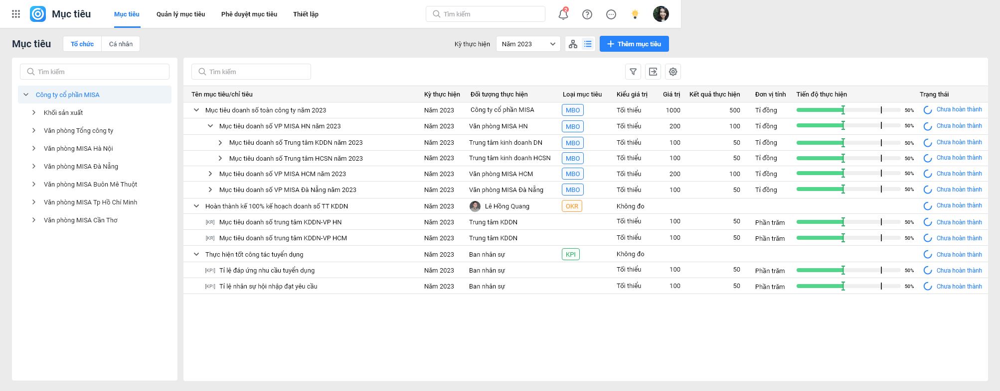

**Description:** Objective management module showing organizational objectives in table format.

**Header:**
- App: "Mục tiêu" (Objectives)
- Tabs: Mục tiêu (Objectives - active), Quản lý mục tiêu (Manage Objectives), Phê duyệt mục tiêu (Approve Objectives), Thiết lập (Settings)

**Left Navigation:**
- Organizational tree:
  - Công ty cổ phần MISA (MISA Joint Stock Company)
    - Khối sản xuất (Production Block)
    - Văn phòng Tổng công ty (Head Office)
    - Văn phòng MISA Hà Nội
    - Văn phòng MISA Đà Nẵng
    - Văn phòng MISA Buôn Mê Thuật
    - Văn phòng MISA Tp Hồ Chí Minh
    - Văn phòng MISA Cần Thơ

**Main Table:**
Columns: Tên mục tiêu/chỉ tiêu (Objective name), Kỳ thực hiện (Period), Đối tượng thực hiện (Target), Loại mục tiêu (Type), Kiểu giá trị (Value type), Giá trị (Value), Kết quả thực hiện (Result), Đơn vị tính (Unit), Tiến độ thực hiện (Progress), Trạng thái (Status)

**Sample Objectives:**
- Mục tiêu doanh số toàn công ty năm 2023 (Company revenue target 2023) - MBO - 1000 tỉ đồng - 50% - Chưa hoàn thành
- Mục tiêu doanh số VP MISA HN năm 2023 - MBO - 200 tỉ đồng - 50% - Chưa hoàn thành
- Các mục tiêu trung tâm kinh doanh - MBO - 100 tỉ đồng - 50% - Chưa hoàn thành
- Hoàn thành kế hoạch doanh số TT KDDN - OKR - Không đo (Not measured)
- Thực hiện tốt công tác tuyển dụng - KPI - 100% - 50% - Chưa hoàn thành

---

### Image 40: Objective Management - Mind Map View
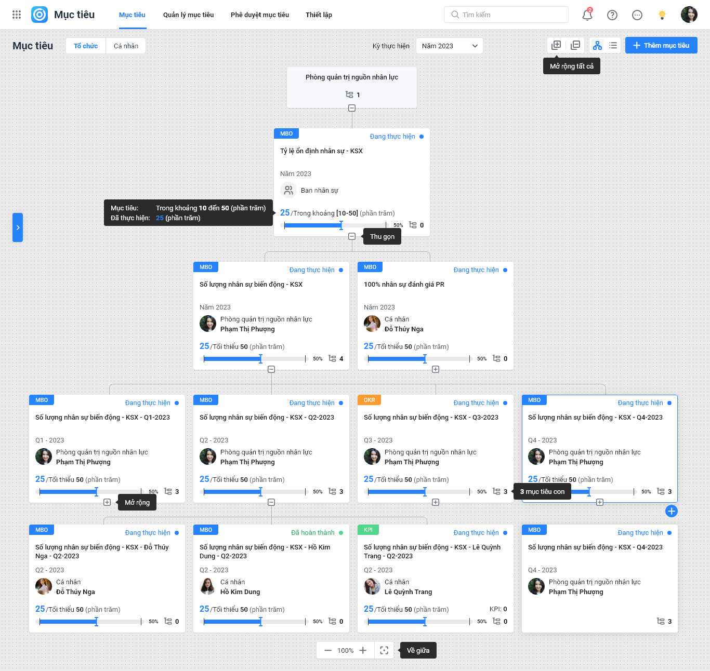

**Description:** Same objective module showing hierarchical mind map visualization.

**Top Level:**
- Phòng quản trị nguồn nhân lực (HR Management Department)
  - Tỷ lệ ổn định nhân sự - KSX (HR Stability Rate) - 2023
  - Target: 25/50 (50%)

**Second Level (Quarterly Breakdown):**
- Q1-2023: Phạm Thị Phương - 25/50 (50%)
- Q2-2023: Phạm Thị Phương - 25/50 (50%)
- Q3-2023: Phạm Thị Phương - 25/50 (50%)
- Q4-2023: Phạm Thị Phương - 25/50 (50%)

**Third Level (Individual Objectives):**
- Q2-2023: Đỗ Thùy Nga - 25/50 (50%)
- Q2-2023: Hồ Kim Dung - 25/50 (50%) - Đã hoàn thành (Completed)
- Q2-2023: Lê Quỳnh Trang - KPI: 0 (50%)

**Labels:** MBO (blue), OKR (orange), KPI (green)
**Status:** Đang thực hiện (In progress), Đã hoàn thành (Completed)

---

### Image 41: Objective Management - Strategy Map (BSC)
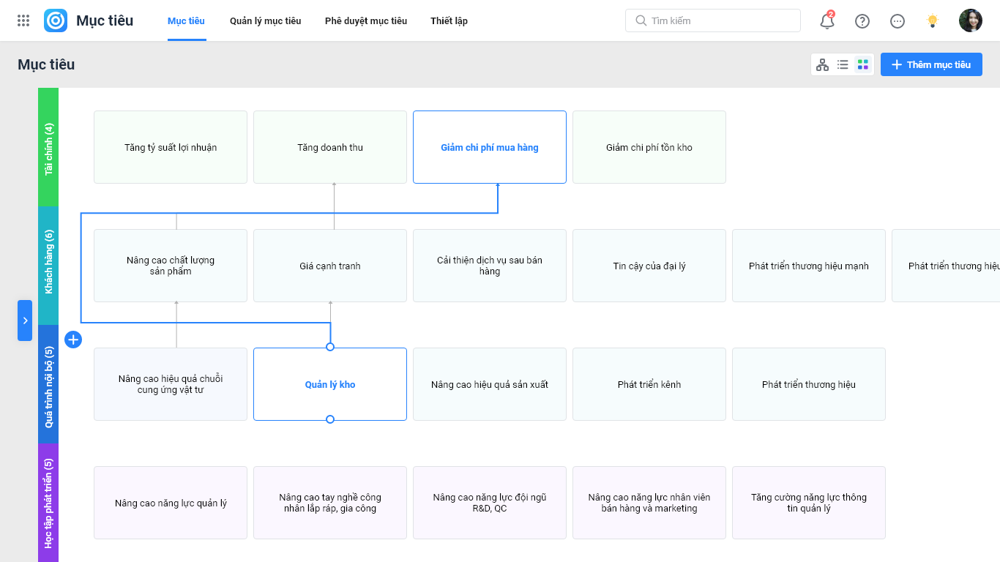

**Description:** Balanced Scorecard (BSC) strategy map showing strategic objectives across 4 perspectives.

**4 Perspectives (Left sidebar):**
1. **Tài chính (4)** (Financial) - Green
2. **Khách hàng (6)** (Customer) - Blue
3. **Quá trình nội bộ (5)** (Internal Process) - Dark Blue
4. **Học tập phát triển (5)** (Learning & Growth) - Purple

**Financial Objectives:**
- Tăng tỷ suất lợi nhuận (Increase profit margin)
- Tăng doanh thu (Increase revenue)
- Giảm chi phí mua hàng (Reduce purchasing cost) - Selected
- Giảm chi phí tồn kho (Reduce inventory cost)

**Customer Objectives:**
- Nâng cao chất lượng sản phẩm (Improve product quality)
- Giá cạnh tranh (Competitive pricing)
- Cải thiện dịch vụ sau bán hàng (Improve after-sales service)
- Tin cậy của đại lý (Dealer trust)
- Phát triển thương hiệu mạnh (Develop strong brand)

**Internal Process Objectives:**
- Nâng cao hiệu quả chuỗi cung ứng vật tư (Improve supply chain efficiency)
- Quản lý kho (Warehouse management) - Selected
- Nâng cao hiệu quả sản xuất (Improve production efficiency)
- Phát triển kênh (Develop channels)
- Phát triển thương hiệu (Develop brand)

**Learning & Growth Objectives:**
- Nâng cao năng lực quản lý (Improve management capability)
- Nâng cao tay nghề công nhân lắp ráp, gia công (Improve assembly worker skills)
- Nâng cao năng lực đội ngũ R&D, QC (Improve R&D and QC team capability)
- Nâng cao năng lực nhân viên bán hàng và marketing (Improve sales and marketing staff capability)
- Tăng cường năng lực thông tin quản lý (Strengthen management information capability)

---

### Image 42: Objective Management - Add Objective Form
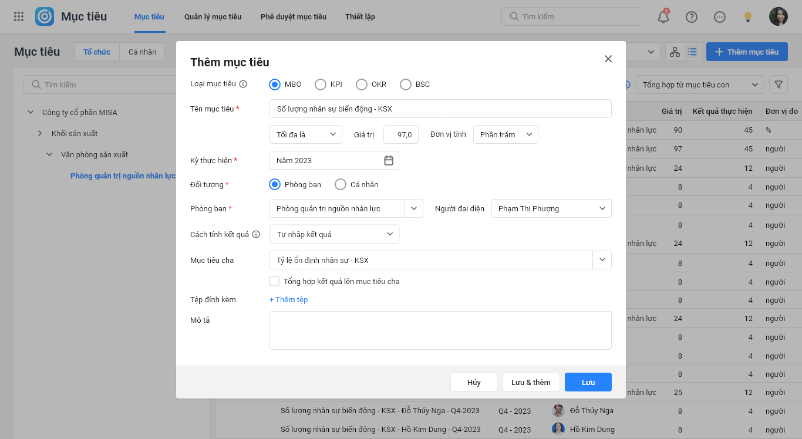

**Description:** Modal form for creating a new objective.

**Form Fields:**
- **Loại mục tiêu (Objective Type):** MBO (selected), KPI, OKR, BSC
- **Tên mục tiêu (Objective Name):** "Số lượng nhân sự biến động - KSX" (HR turnover - Production)
- **Value Settings:**
  - Tối đa là (Maximum is): 97.0
  - Đơn vị tính (Unit): Phần trăm (Percent)
- **Kỳ thực hiện (Period):** Năm 2023 (Year 2023)
- **Đối tượng (Target):** Phòng ban (Department - selected), Cá nhân (Individual)
- **Phòng ban (Department):** Phòng quản trị nguồn nhân lực (HR Management)
- **Người đại diện (Representative):** Phạm Thị Phương
- **Cách tính kết quả (Calculation method):** Tự nhập kết quả (Manual entry)
- **Mục tiêu cha (Parent objective):** "Tỷ lệ ổn định nhân sự - KSX" (HR stability rate)
- Checkbox: Tổng hợp kết quả lên mục tiêu cha (Aggregate results to parent objective)
- Tệp đính kèm (Attachments): + Thêm tệp (Add file)
- Mô tả (Description): Empty

**Buttons:** Hủy (Cancel), Lưu & thêm (Save & add), Lưu (Save)

---

### Image 43: Performance Evaluation - Create Evaluation Period
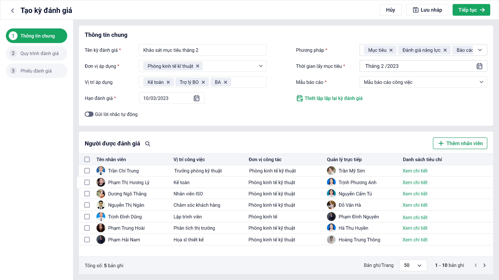

**Description:** Form for creating a new performance evaluation period.

**Left Steps:**
1. Thông tin chung (General Information) - Active
2. Quy trình đánh giá (Evaluation Process)
3. Phiếu đánh giá (Evaluation Form)

**Top Right Buttons:** Hủy (Cancel), Lưu nháp (Save Draft), Tiếp tục (Continue)

**General Information Section:**
- Tên kỳ đánh giá (Evaluation period name): "Khảo sát mục tiêu tháng 2" (February Objective Survey)
- Đơn vị áp dụng (Applied unit): "Phòng kinh tế kĩ thuật" (Technical Economics Department)
- Vị trí áp dụng (Applied positions): Kế toán (Accounting), Trợ lý BO (BO Assistant), BA
- Hạn đánh giá (Evaluation deadline): 10/03/2023
- Phương pháp (Method): Mục tiêu (Objectives), Đánh giá năng lực (Competency Evaluation), Báo cáo công việc (Work Report)
- Thời gian lấy mục tiêu (Objective collection time): Tháng 2/2023
- Mẫu báo cáo (Report template): Mẫu báo cáo công việc (Work report template)
- Toggle: Gửi lời nhắc tự động (Send automatic reminders)
- Link: Thiết lập lặp lại kỳ đánh giá (Set up recurring evaluation period)

**Employees to be Evaluated (Người được đánh giá):**
Table with columns: Tên nhân viên (Employee name), Vị trí công việc (Position), Đơn vị công tác (Department), Quản lý trực tiếp (Direct Manager), Danh sách tiêu chí (Criteria list)

**Employees:**
1. Trần Chí Trung - Trưởng phòng kỹ thuật - Trần Mỹ Sim
2. Phạm Thị Hương Lý - Kế toán - Trịnh Phương Anh
3. Dương Ngô Thắng - Nhân viên ISO - Nguyễn Cẩm Tú
4. Nguyễn Thị Ngân - Chăm sóc khách hàng - Đỗ Văn Hà
5. Trịnh Đình Dũng - Lập trình viên - Phạm Đình Nguyên
6. Phạm Trung Hoài - Phân tích thị trường - Hà Thu Huyền
7. Phạm Hải Nam - Họa sĩ thiết kế - Hoàng Trung Thông

**Footer:** Tổng số: 5 bản ghi (Total: 5 records), 50 records per page

---

### Image 44: Performance Evaluation - Gantt Chart View
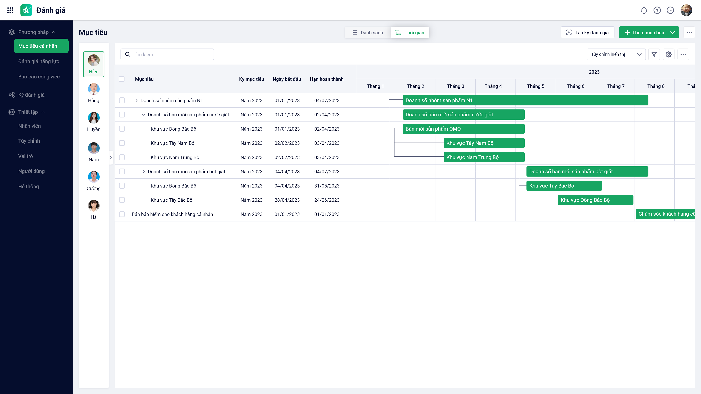

**Description:** Performance evaluation module showing objectives in Gantt chart timeline view.

**Left Navigation:**
- Phương pháp (Methods)
  - Mục tiêu cá nhân (Personal Objectives) - Active
  - Đánh giá năng lực (Competency Evaluation)
  - Báo cáo công việc (Work Report)
- Kỳ đánh giá (Evaluation Period)
- Thiết lập (Settings)
  - Nhân viên (Employees)
  - Tùy chỉnh (Customize)
  - Vai trò (Roles)
  - Người dùng (Users)
  - Hệ thống (System)

**Employee List (Left sidebar):**
- Hiền (selected), Hùng, Huyền, Nam, Cường, Hà

**Main Gantt Chart:**
- Tabs: Danh sách (List), Thời gian (Timeline) - Timeline active
- Columns: Mục tiêu (Objective), Kỳ mục tiêu (Period), Ngày bắt đầu (Start date), Hạn hoàn thành (Deadline), then monthly columns Tháng 1-12

**Objectives with Timeline Bars:**
- Doanh số nhóm sản phẩm N1: Jan 1 - Jul 4, 2023
- Doanh số bán mới sản phẩm nước giặt: Jan 1 - Apr 2, 2023
  - Khu vực Đông Bắc Bộ: Jan 1 - Apr 2
  - Bán mới sản phẩm OMO
  - Khu vực Tây Nam Bộ: Feb 2 - Apr 3
  - Khu vực Nam Trung Bộ: Feb 2 - Apr 3
- Doanh số bán mới sản phẩm bột giặt: Apr 4 - Jul 4, 2023
  - Khu vực Đông Bắc Bộ: Apr 4 - May 31
  - Khu vực Tây Bắc Bộ: Apr 28 - Jun 24
- Bán bảo hiểm cho khách hàng cá nhân: Jan 1 - Jan 1, 2023
  - Chăm sóc khách hàng cũ (Existing customer care)

---

### Image 45: Performance Evaluation - Results Radar Chart
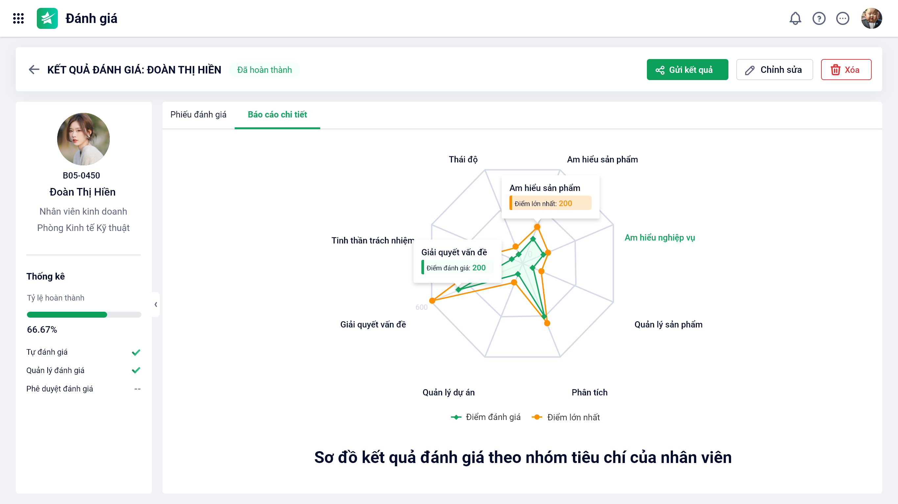

**Description:** Individual employee evaluation results showing radar/spider chart visualization.

**Header:**
- Title: "KẾT QUẢ ĐÁNH GIÁ: ĐOÀN THỊ HIỀN" (EVALUATION RESULTS: DOAN THI HIEN)
- Status: Đã hoàn thành (Completed)
- Buttons: Gửi kết quả (Send Results), Chỉnh sửa (Edit), Xóa (Delete)

**Left Panel - Employee Info:**
- Photo of Đoàn Thị Hiền
- ID: B05-0450
- Position: Nhân viên kinh doanh (Sales staff)
- Department: Phòng Kinh tế Kỹ thuật (Technical Economics Department)

**Statistics (Thống kê):**
- Tỷ lệ hoàn thành (Completion rate): 66.67%
- Tự đánh giá (Self-evaluation): ✓
- Quản lý đánh giá (Manager evaluation): ✓
- Phê duyệt đánh giá (Approval): --

**Main Content - Radar Chart:**
Title: "Sơ đồ kết quả đánh giá theo nhóm tiêu chí của nhân viên" (Employee evaluation results by criteria group)

**Criteria (spokes of radar):**
- Thái độ (Attitude)
- Am hiểu sản phẩm (Product knowledge)
- Am hiểu nghiệp vụ (Business knowledge)
- Quản lý sản phẩm (Product management)
- Phân tích (Analysis)
- Quản lý dự án (Project management)
- Giải quyết vấn đề (Problem solving)
- Tinh thần trách nhiệm (Responsibility)

**Chart Legend:**
- Green: Điểm đánh giá (Evaluation score)
- Orange: Điểm lớn nhất (Maximum score)

**Tooltips:**
- Am hiểu sản phẩm - Điểm lớn nhất: 200
- Giải quyết vấn đề - Điểm đánh giá: 200

---

### Image 46: Evaluation Template Library
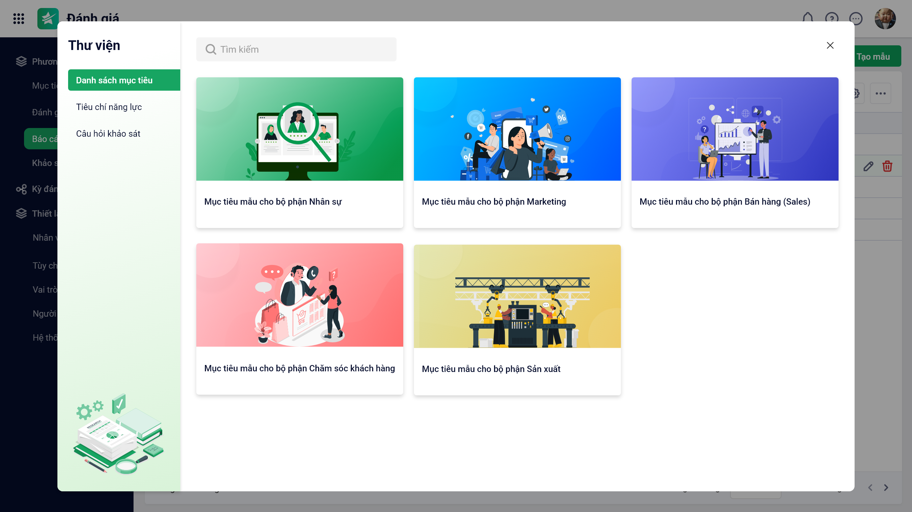

**Description:** Template library modal for evaluation objectives organized by department.

**Left Navigation:**
- Danh sách mục tiêu (Objective list) - Active
- Tiêu chí năng lực (Competency criteria)
- Câu hỏi khảo sát (Survey questions)

**Template Cards:**
1. **Mục tiêu mẫu cho bộ phận Nhân sự** (HR Department Template) - Green card
2. **Mục tiêu mẫu cho bộ phận Marketing** (Marketing Department Template) - Blue card
3. **Mục tiêu mẫu cho bộ phận Bán hàng (Sales)** (Sales Department Template) - Purple card
4. **Mục tiêu mẫu cho bộ phận Chăm sóc khách hàng** (Customer Care Template) - Pink card
5. **Mục tiêu mẫu cho bộ phận Sản xuất** (Production Department Template) - Yellow card

Each card has an illustration representing the department.

---

### Image 47: Time Tracking - Overview Dashboard
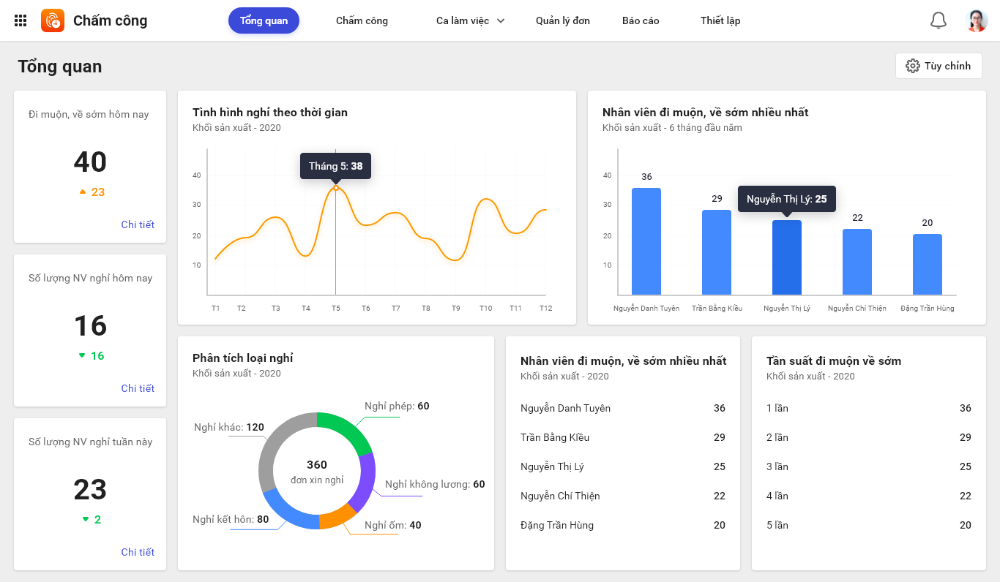

**Description:** Time tracking module overview dashboard with attendance analytics.

**Header:**
- App: "Chấm công" (Time Tracking)
- Tabs: Tổng quan (Overview - active), Chấm công (Time Sheet), Ca làm việc (Shifts), Quản lý đơn (Request Management), Báo cáo (Reports), Thiết lập (Settings)

**Left Summary Cards:**
- Đi muộn, về sớm hôm nay (Late/Early today): 40 ↑23
- Số lượng NV nghỉ hôm nay (Employees absent today): 16 ↓16
- Số lượng NV nghỉ tuần này (Employees absent this week): 23 ↓2

**Main Charts:**

**1. Leave Status Over Time (Tình hình nghỉ theo thời gian):**
- Line chart showing leave trends by month
- Tooltip: Tháng 5: 38 leave requests

**2. Most Late/Early Employees (Nhân viên đi muộn, về sớm nhiều nhất):**
- Bar chart: Top 5 employees
  - Nguyễn Danh Tuyển: 36
  - Trần Bằng Kiều: 29
  - Nguyễn Thị Lý: 25
  - Nguyễn Chí Thiện: 22
  - Đặng Trần Hùng: 20

**3. Leave Type Analysis (Phân tích loại nghỉ):**
- Donut chart: 360 total leave requests
  - Nghỉ phép (Leave): 60
  - Nghỉ không lương (Unpaid leave): 60
  - Nghỉ ốm (Sick leave): 40
  - Nghỉ kết hôn (Marriage leave): 80
  - Nghỉ khác (Other): 120

**4. Late/Early Frequency (Tần suất đi muộn về sớm):**
- Table showing frequency:
  - 1 lần: 36 employees
  - 2 lần: 29 employees
  - 3 lần: 25 employees
  - 4 lần: 22 employees
  - 5 lần: 20 employees

---

### Image 48: Shift Schedule Setup
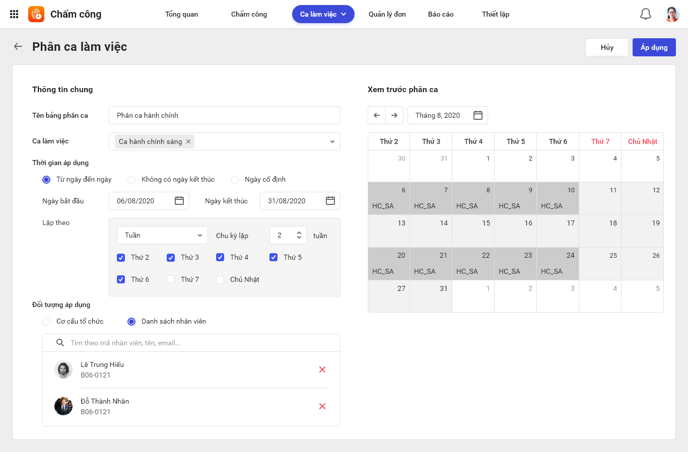

**Description:** Shift schedule configuration form with calendar preview.

**Header:**
- Title: "Phân ca làm việc" (Shift Schedule)
- Buttons: Hủy (Cancel), Áp dụng (Apply)

**Left Form - General Info (Thông tin chung):**
- Tên bảng phân ca (Schedule name): "Phân ca hành chính" (Administrative shift)
- Ca làm việc (Work shift): "Ca hành chính sáng" (Morning administrative shift)
- Thời gian áp dụng (Application period):
  - Từ ngày đến ngày (From date to date) - Selected
  - Không có ngày kết thúc (No end date)
  - Ngày cố định (Fixed date)
- Ngày bắt đầu (Start date): 06/08/2020
- Ngày kết thúc (End date): 31/08/2020
- Lặp theo (Repeat by): Tuần (Week), every 2 weeks
- Days: Thứ 2-6 checked, Thứ 7 and Chủ Nhật unchecked

**Apply to (Đối tượng áp dụng):**
- Cơ cấu tổ chức (Organization structure)
- Danh sách nhân viên (Employee list) - Selected
  - Lê Trung Hiếu - B06-0121
  - Đỗ Thành Nhân - B06-0121

**Right Panel - Calendar Preview (Xem trước phân ca):**
- Calendar showing August 2020
- Working days (Mon-Fri) marked with "HC_SA" (Hành chính sáng - Morning administrative)
- Weekends unmarked

---

### Image 49: Shift Schedule - Summary Table
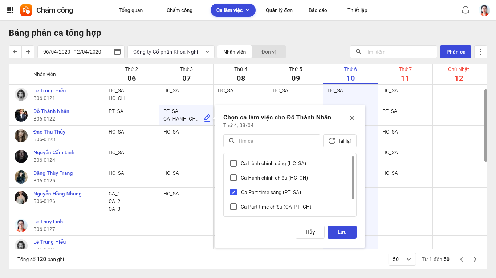

**Description:** Comprehensive shift schedule table showing all employees' shifts.

**Header:**
- Title: "Bảng phân ca tổng hợp" (Comprehensive Shift Schedule)
- Date range: 06/04/2020 - 12/04/2020
- Company: Công ty Cổ phần Khoa Nghi
- Toggle: Nhân viên (Employee) / Đơn vị (Unit)
- Button: Phân ca (Assign Shift)

**Main Table:**
- Rows: Employees with photos and IDs
- Columns: Days of week (Thứ 2-6 in black, Thứ 7-CN in red)

**Shift Codes:**
- HC_SA: Hành chính sáng (Morning administrative)
- HC_CH: Hành chính chiều (Afternoon administrative)
- PT_SA: Part time sáng (Part-time morning)
- CA_1, CA_2, CA_3: Shift 1, 2, 3

**Sample Employees:**
- Lê Trung Hiếu - HC_SA all days
- Đỗ Thành Nhân - PT_SA, CA_HANH_CH...
- Nguyễn Hồng Nhung - CA_1, CA_2, CA_3 (multiple shifts)

**Shift Selection Modal:**
- Title: "Chọn ca làm việc cho Đỗ Thành Nhân" (Select shift for Do Thanh Nhan)
- Date: Thứ 4, 08/04
- Options:
  - Ca Hành chính sáng (HC_SA)
  - Ca Hành chính chiều (HC_CH)
  - Ca Part time sáng (PT_SA) - Checked
  - Ca Part time chiều (CA_PT_CH)
- Buttons: Hủy (Cancel), Lưu (Save)

**Footer:** Tổng số 120 bản ghi (120 records)

---

### Image 50: Payroll - Dashboard (Duplicate)
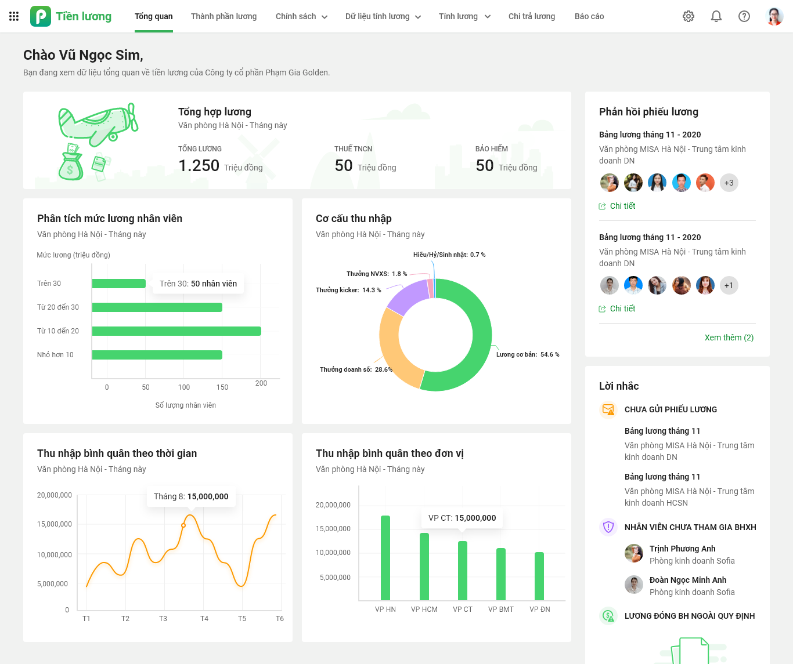

**Description:** Identical to Image 20 - Payroll module dashboard overview.

---

### Image 51: Payroll - Income Summary Report
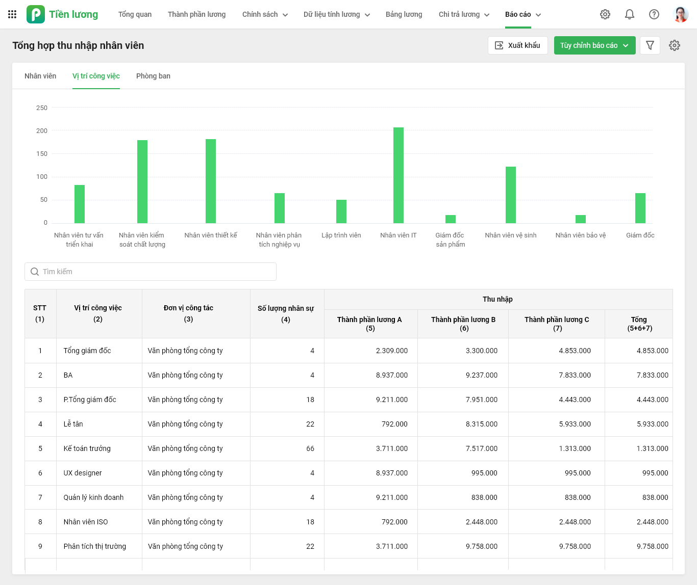

**Description:** Payroll module showing employee income summary by position.

**Header:**
- Title: "Tổng hợp thu nhập nhân viên" (Employee Income Summary)
- Tabs: Nhân viên (Employee), Vị trí công việc (Position - active), Phòng ban (Department)
- Buttons: Xuất khẩu (Export), Tùy chỉnh báo cáo (Customize report)

**Bar Chart - Income by Position:**
Showing income levels for different positions:
- Nhân viên tư vấn triển khai (Implementation consultant)
- Nhân viên kiểm soát chất lượng (Quality control)
- Nhân viên thiết kế (Designer)
- Nhân viên phân tích nghiệp vụ (Business analyst)
- Lập trình viên (Developer)
- Nhân viên IT (IT staff) - Highest
- Giám đốc sản phẩm (Product Director)
- Nhân viên vệ sinh (Cleaner)
- Nhân viên bảo vệ (Security)
- Giám đốc (Director)

**Data Table:**
Columns: STT, Vị trí công việc (Position), Đơn vị công tác (Department), Số lượng nhân sự (Headcount), Thành phần lương A/B/C (Salary components A/B/C), Tổng (Total)

**Sample Data:**
1. Tổng giám đốc (CEO): 4 people - Total: 4,853,000
2. BA (Business Analyst): 4 people - Total: 7,833,000
3. P.Tổng giám đốc (Deputy CEO): 18 people - Total: 4,443,000
4. Lễ tân (Receptionist): 22 people - Total: 5,933,000
5. Kế toán trưởng (Chief Accountant): 66 people - Total: 1,313,000
6. UX designer: 4 people - Total: 995,000
7. Quản lý kinh doanh (Sales Manager): 4 people - Total: 838,000
8. Nhân viên ISO: 18 people - Total: 2,448,000
9. Phân tích thị trường (Market Analyst): 22 people - Total: 9,758,000

---

### Image 52: Social Insurance - Electronic Records
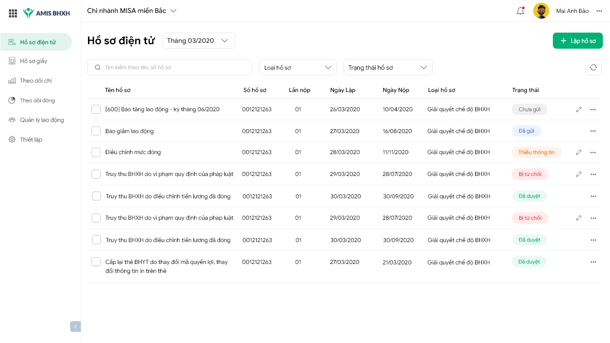

**Description:** Social insurance module showing electronic record management.

**Header:**
- App: "AMIS BHXH" (AMIS Social Insurance)
- Branch: Chi nhánh MISA miền Bắc (MISA Northern Branch)
- User: Mai Anh Bảo

**Left Navigation:**
- Hồ sơ điện tử (Electronic Records) - Active
- Hồ sơ giấy (Paper Records)
- Theo dõi chi (Payment Tracking)
- Theo dõi đóng (Contribution Tracking)
- Quản lý lao động (Labor Management)
- Thiết lập (Settings)

**Main Content:**
- Title: "Hồ sơ điện tử" (Electronic Records)
- Month selector: Tháng 03/2020
- Search, Type filter, Status filter
- Button: + Lập hồ sơ (Create Record)

**Table Columns:**
- Tên hồ sơ (Record name)
- Số hồ sơ (Record number)
- Lần nộp (Submission count)
- Ngày Lập (Created date)
- Ngày Nộp (Submission date)
- Loại hồ sơ (Record type)
- Trạng thái (Status)

**Sample Records:**
1. [600] Báo tăng lao động - kỳ tháng 06/2020 - Chưa gửi (Not sent)
2. Báo giảm lao động - Đã gửi (Sent)
3. Điều chỉnh mức đóng - Thiếu thông tin (Missing info)
4. Truy thu BHXH do vi phạm - Bị từ chối (Rejected)
5. Truy thu BHXH do điều chỉnh lương - Đã duyệt (Approved)
6. Various other records with different statuses

---

### Image 53: Social Insurance - Create Electronic Record
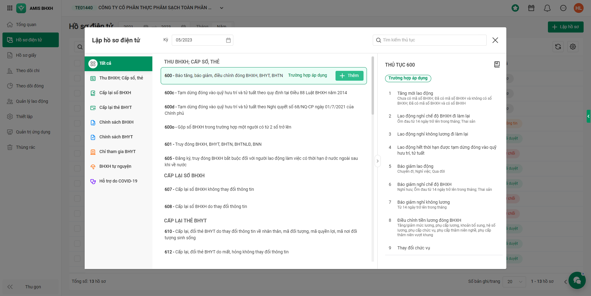

**Description:** Modal for creating a new electronic social insurance record.

**Left Navigation:**
- Tất cả (All) - Active
- Thu BHXH; Cấp số, thẻ (SI Collection; Number/Card issuance)
- Cấp lại số BHXH (Reissue SI number)
- Cấp lại thẻ BHYT (Reissue HI card)
- Chính sách BHXH (SI Policy)
- Chính sách BHYT (HI Policy)
- Chỉ tham gia BHYT (HI only)
- BHXH tự nguyện (Voluntary SI)
- Hồ trợ do COVID-19 (COVID-19 Support)

**Center - Procedure List:**
- **THU BHXH; CẤP SỐ, THẺ:**
  - 600 - Báo tăng, báo giảm, điều chỉnh đóng BHXH, BHYT, BHTN (Increase, decrease, adjust SI/HI/UI contributions)
  - 600c - Temporary suspension for retirement/age per Article 88 of 2014 SI Law
  - 600d - Temporary suspension per Government Resolution 68/NQ-CP
  - 600o - Merging SI numbers for person with 2+ numbers
  - 601 - Retroactive SI/HI/UI contributions
  - 605 - Registration, retroactive compulsory SI for overseas workers
  - **CẤP LẠI SỐ BHXH:**
  - 607 - Reissue SI number without info change
  - 608 - Reissue SI number with info change
  - **CẤP LẠI THẺ BHYT:**
  - 610 - Reissue HI card for personal info change
  - 612 - Reissue HI card for loss/damage

**Right Panel - Procedure 600 Details:**
- Title: "THỦ TỤC 600" (Procedure 600)
- Cases:
  1. Tăng mới lao động (New employee addition)
  2. Lao động nghỉ chế độ BHXH đi làm lại (Employee returning after SI benefit)
  3. Lao động nghỉ không lương đi làm lại (Employee returning after unpaid leave)
  4. Lao động hết thời hạn tạm dừng đóng (End of contribution suspension)
  5. Báo giảm lao động (Employee reduction)
  6. Báo giảm nghỉ chế độ BHXH (SI benefit reduction)
  7. Báo giảm nghỉ không lương (Unpaid leave reduction)
  8. Điều chỉnh tiền lương đóng BHXH (Adjust SI contribution salary)
  9. Thay đổi chức vụ (Position change)

---

### Image 54: Social Insurance - Employee List for Submission
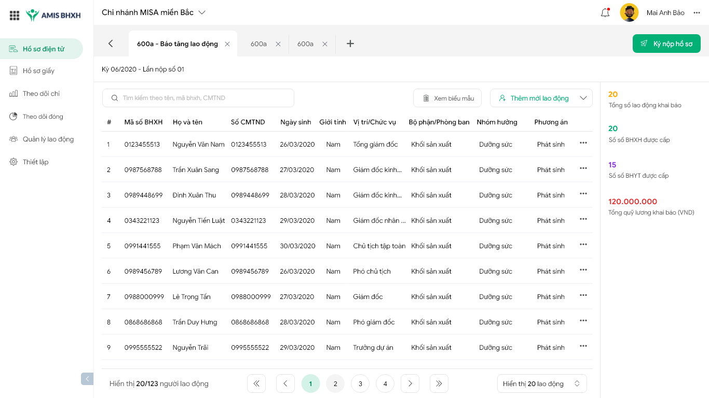

**Description:** Employee list for social insurance submission form 600a.

**Header:**
- Tab: "600a - Báo tăng lao động" (Report employee increase)
- Period: Kỳ 06/2020 - Lần nộp số 01 (Period 06/2020 - Submission 01)
- Button: Kỳ nộp hồ sơ (Submission period)

**Main Table:**
Columns: #, Mã số BHXH (SI number), Họ và tên (Full name), Số CMTND (ID number), Ngày sinh (DOB), Giới tính (Gender), Vị trí/Chức vụ (Position), Bộ phận/Phòng ban (Department), Nhóm hưởng (Benefit group), Phương án (Option)

**Sample Employees (20 shown of 123):**
1. Nguyễn Văn Nam - 0123455513 - 26/03/2020 - Nam - Tổng giám đốc - Khối sản xuất - Dưỡng sức
2. Trần Xuân Sang - 0987568788 - 27/03/2020 - Nam - Giám đốc kinh doanh - Khối sản xuất - Dưỡng sức
3. Various other employees with positions from Chủ tịch tập đoàn to Trưởng dự án

**Right Summary:**
- 20: Tổng số lao động khai báo (Total declared employees)
- 20: Số sổ BHXH được cấp (SI books issued)
- 15: Số sổ BHYT được cấp (HI cards issued)
- 120,000,000: Tổng quỹ lương khai báo (VND) (Total declared salary fund)

---

### Image 55: Task Management - Dashboard (Duplicate)

**Description:** Identical to Image 17 - Task Management dashboard overview.

---

### Image 56: Workflow - Run History (Different View)
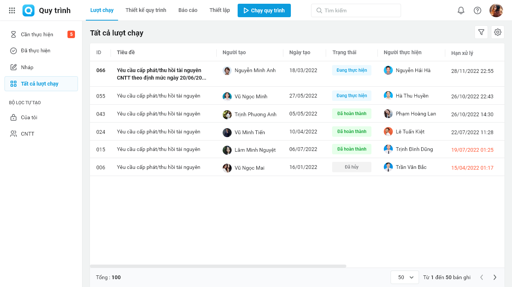

**Description:** Workflow module showing run history with different sidebar layout.

**Left Navigation:**
- Cần thực hiện (To Do) - 5
- Đã thực hiện (Done)
- Nháp (Draft)
- Tất cả lượt chạy (All Runs) - Active
- BỘ LỌC TỰ TẠO (Custom Filters)
  - Của tôi (Mine)
  - CNTT (IT)

**Main Table - All Runs:**
Columns: ID, Tiêu đề (Title), Người tạo (Creator), Ngày tạo (Created Date), Trạng thái (Status), Người thực hiện (Executor), Hạn xử lý (Deadline)

**Sample Records:**
- 066: "Yêu cầu cấp phát/thu hồi tài nguyên CNTT..." - Đang thực hiện - Nguyễn Hải Hà - 28/11/2022
- 055: Same type - Đang thực hiện - Hà Thu Huyền - 26/10/2022
- 043: Same type - Đã hoàn thành - Phạm Hoàng Lan - 26/10/2022
- 024: Same type - Đã hoàn thành - Lê Tuấn Kiệt - 22/07/2022
- 015: Same type - Đã hoàn thành - Trịnh Đình Dũng - 19/07/2022
- 006: Same type - Đã hủy - Trần Văn Bắc - 15/04/2022

---

### Image 57: Electronic Signature - WeSign Dashboard

**Description:** WeSign electronic signature dashboard overview.

**Left Navigation:**
- Tổng quan (Overview) - Active
- Danh sách tài liệu (Document List)
- Danh sách người ký (Signer List)
- Danh sách loại tài liệu (Document Type List)
- Quản lý người dùng (User Management)
- Nhật ký truy cập (Access Log)

**Top Summary Cards:**
- 12 - Chờ tôi ký (Waiting for my signature)
- 12 - Chờ người khác ký (Waiting for others to sign)
- 168 - Hoàn thành (Completed)
- 4 - Từ chối ký (Signature rejected)

**Main Upload Area:**
- "Thả tệp vào đây hoặc tải lên tệp để bắt đầu" (Drop files here or upload to begin)
- Supported formats: pdf, docx, doc, jpg, png
- Button: Bắt đầu (Start)

**Bottom Cards:**
1. Help card: "Bạn cần trợ giúp và hướng dẫn?" with FAQ link
2. Mobile app card: "Tải xuống ứng dụng di động" (Download mobile app) - "Ký tài liệu ở mọi lúc, mọi nơi" (Sign documents anytime, anywhere)

---

### Image 58: Internal Social Network - Feed (Duplicate)
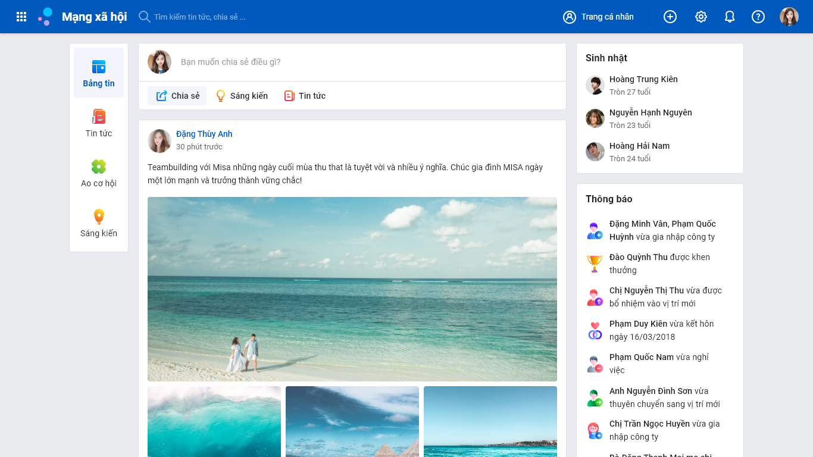

**Description:** Identical to Image 19 - Internal social network feed.

---

### Image 59: Asset Management - Dashboard (Duplicate)
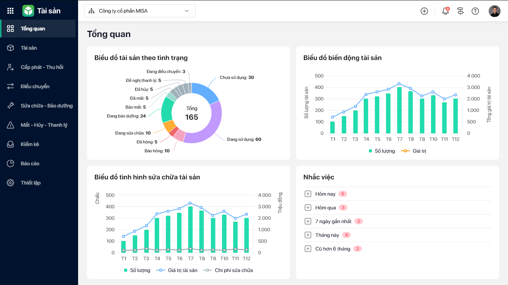

**Description:** Identical to Image 11 - Asset Management dashboard overview.

---

### Image 60: Operations Dashboard - System Administration
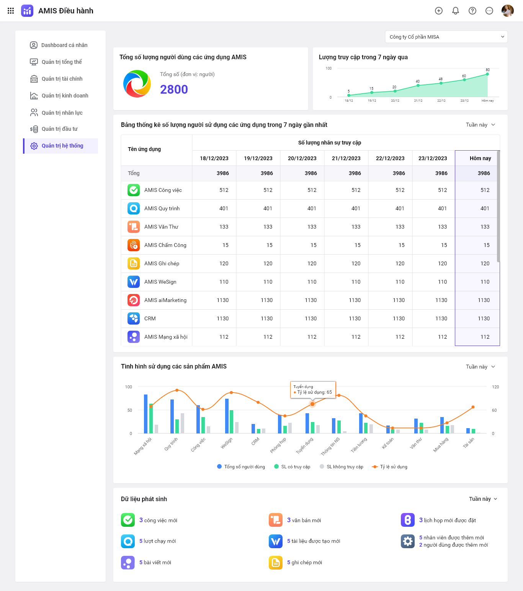

**Description:** Operations management dashboard showing system-wide usage statistics.

**Header:**
- App: "AMIS Điều hành" (AMIS Operations)
- Company: Công ty Cổ phần MISA

**Left Navigation:**
- Dashboard cá nhân (Personal Dashboard)
- Quản trị tổng thể (Overall Administration)
- Quản trị tài chính (Financial Administration)
- Quản trị kinh doanh (Business Administration)
- Quản trị nhân lực (HR Administration)
- Quản trị đầu tư (Investment Administration)
- Quản trị hệ thống (System Administration) - Active

**Top Summary:**
- **Total users:** 2,800 people
- **Access trend (last 7 days):** Growing from 5 to 80 users

**User Access Table (Last 7 Days):**
Shows daily active users per application:
- AMIS Công việc (Tasks): 512 daily
- AMIS Quy trình (Workflow): 401 daily
- AMIS Văn Thư (Correspondence): 133 daily
- AMIS Chấm Công (Time Tracking): 15 daily
- AMIS Ghi chép (Notes): 120 daily
- AMIS WeSign: 110 daily
- AMIS aiMarketing: 1,130 daily
- CRM: 1,130 daily
- AMIS Mạng xã hội (Social Network): 112 daily

**Product Usage Chart:**
- Bar chart showing total users, active users, inactive users
- Line showing usage rate
- Highest usage: Mạng xã hội, Quy trình, Công việc
- Lowest: Kế toán, Văn thư

**Generated Data This Week:**
- 3 công việc mới (new tasks)
- 5 lượt chạy mới (new workflow runs)
- 5 bài viết mới (new posts)
- 3 văn bản mới (new documents)
- 5 tài liệu mới (new documents)
- 5 ghi chép mới (new notes)
- 3 lịch họp mới (new meetings)
- 5 nhân viên mới (new employees)

---

### Image 61: Operations Dashboard - Workflow Statistics
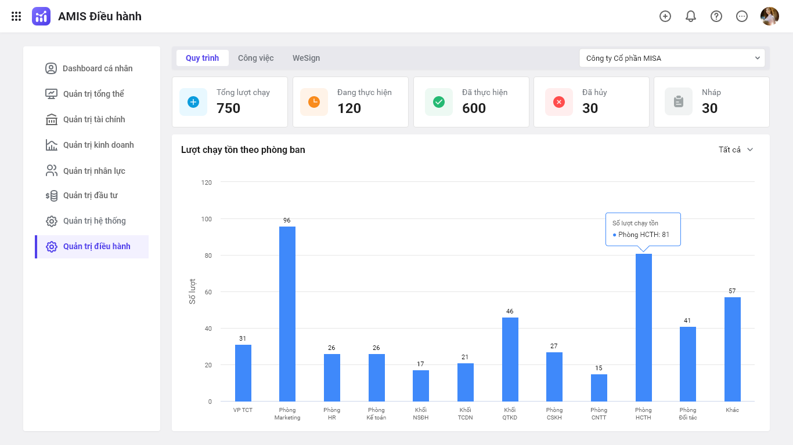

**Description:** Operations dashboard showing workflow run statistics by department.

**Left Navigation:** Quản trị điều hành (Operations Administration) - Active

**Top Tabs:** Quy trình (Workflow), Công việc (Tasks), WeSign

**Summary Cards:**
- Tổng lượt chạy (Total runs): 750
- Đang thực hiện (In progress): 120
- Đã thực hiện (Completed): 600
- Đã hủy (Cancelled): 30
- Nháp (Draft): 30

**Bar Chart - Pending Runs by Department (Lượt chạy tồn theo phòng ban):**
- VP TCT: 31
- Phòng Marketing: 96 (highest)
- Phòng HR: 26
- Phòng Kế toán: 26
- Khối NSBH: 17
- Khối TCDN: 21
- Khối QTKD: 46
- Phòng CSKH: 27
- Phòng CNTT: 15
- Phòng HCTH: 81 (tooltip showing 81 pending)
- Phòng Đối tác: 41
- Khác (Other): 57

---

### Image 62: Operations Dashboard - Financial Management
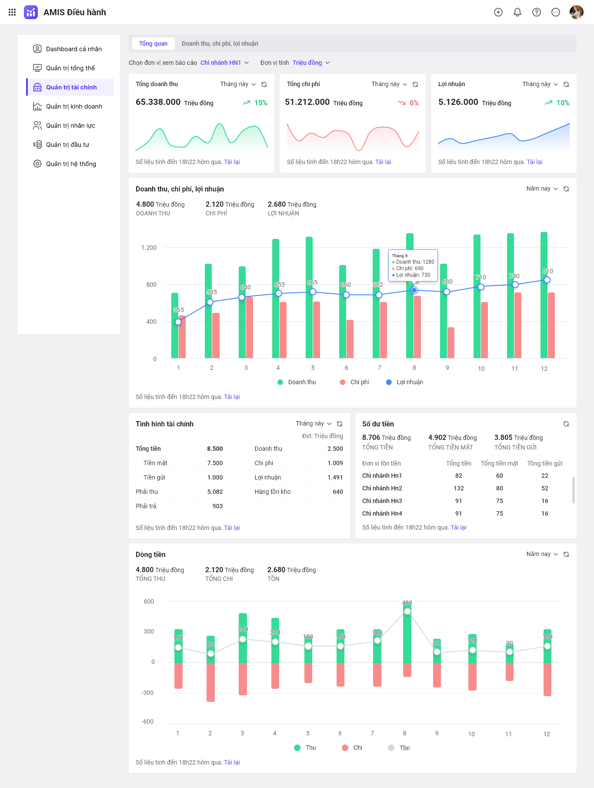

**Description:** Operations dashboard showing financial administration overview.

**Left Navigation:** Quản trị tài chính (Financial Administration) - Active

**Top Tabs:** Tổng quan (Overview), Doanh thu, chi phí, lợi nhuận (Revenue, Expenses, Profit)

**Summary Cards (This Month):**
- **Tổng doanh thu (Total Revenue):** 65,338,000 Triệu đồng ↑15%
- **Tổng chi phí (Total Expenses):** 51,212,000 Triệu đồng ↓6%
- **Lợi nhuận (Profit):** 5,126,000 Triệu đồng ↑10%

**Charts:**

**1. Revenue, Expenses, Profit (Doanh thu, chi phí, lợi nhuận):**
- Monthly bar chart (1-12)
- DOANH THU (Revenue): 4,800 Triệu đồng
- CHI PHÍ (Expenses): 2,120 Triệu đồng
- LỢI NHUẬN (Profit): 2,680 Triệu đồng
- Tooltip for Month 8: Revenue 1280, Expenses 690, Profit 730

**2. Financial Status (Tình hình tài chính):**
- Same as Image 15

**3. Cash Balances (Số dư tiền):**
- TỔNG TIỀN (Total): 8,706 Triệu đồng
- TỔNG TIỀN MẶT (Cash): 4,902 Triệu đồng
- TỔNG TIỀN GỬI (Deposit): 3,805 Triệu đồng
- Breakdown by branch: Hn1, Hn2, Hn3, Hn4

**4. Cash Flow (Dòng tiền):**
- Same as Image 15

---

### Image 63: Operations Dashboard - HR Management
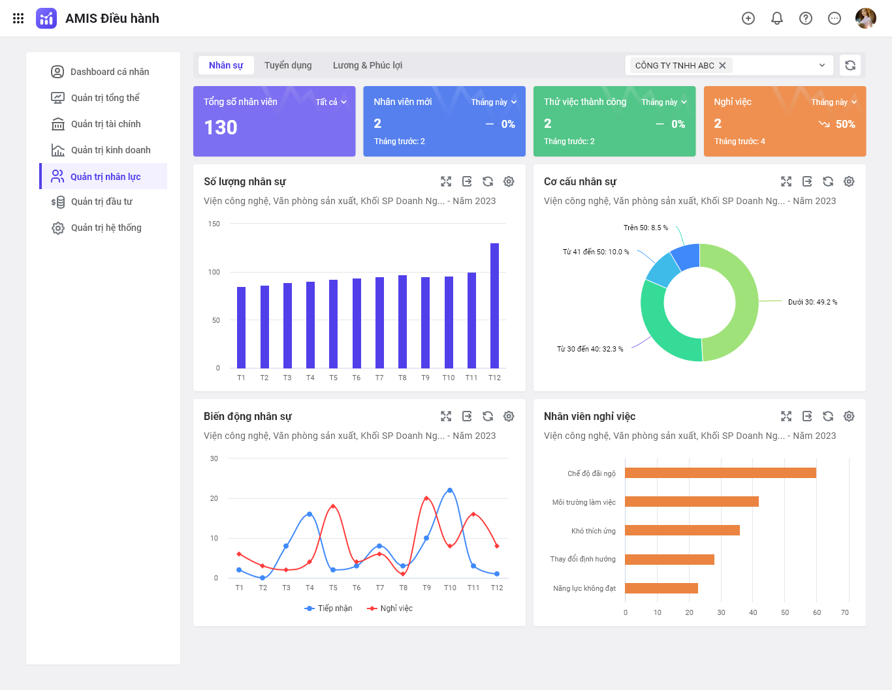

**Description:** Operations dashboard showing HR administration overview.

**Left Navigation:** Quản trị nhân lực (HR Administration) - Active

**Top Tabs:** Nhân sự (HR), Tuyển dụng (Recruitment), Lương & Phúc lợi (Salary & Benefits)

**Summary Cards (This Month):**
- **Tổng số nhân viên (Total employees):** 130
- **Nhân viên mới (New employees):** 2 (0% change)
- **Thử việc thành công (Successful probation):** 2 (0% change)
- **Nghỉ việc (Resignations):** 2 ↓50% (Last month: 4)

**Charts:**

**1. Employee Count (Số lượng nhân sự):**
- Monthly bar chart T1-T12
- Growing from ~80 to ~130

**2. HR Structure (Cơ cấu nhân sự):**
- Donut chart by age:
  - Dưới 30: 49.2%
  - Từ 30 đến 40: 32.3%
  - Từ 41 đến 50: 10.0%
  - Trên 50: 8.5%

**3. HR Movement (Biến động nhân sự):**
- Line chart showing hiring (blue) and resignation (red) trends
- Peaks in T4, T5, T9, T10

**4. Resignation Reasons (Nhân viên nghỉ việc):**
- Horizontal bar chart:
  - Chế độ đãi ngộ (Benefits): ~60 (highest)
  - Môi trường làm việc (Work environment): ~35
  - Khó thích ứng (Adaptation difficulty): ~30
  - Thay đổi định hướng (Career change): ~25
  - Năng lực không đạt (Performance): ~20

---

### Image 64: Electronic Signature - WeSign Dashboard (Duplicate)
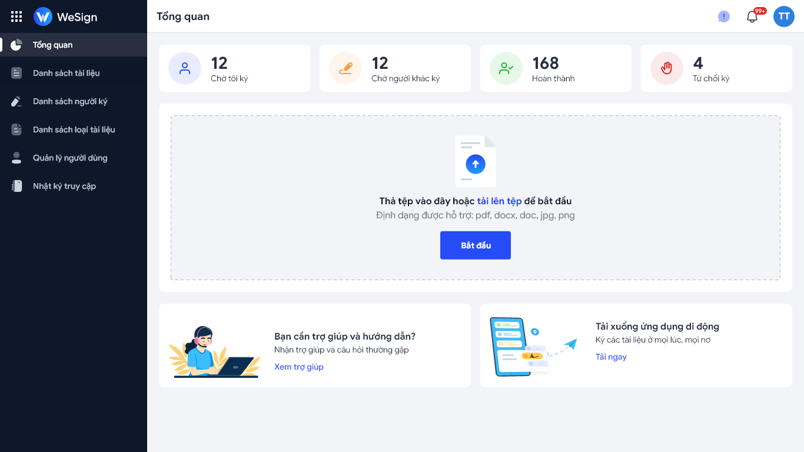

**Description:** Identical to Image 57 - WeSign electronic signature dashboard.

---

### Image 65: ShortLink - Product Image
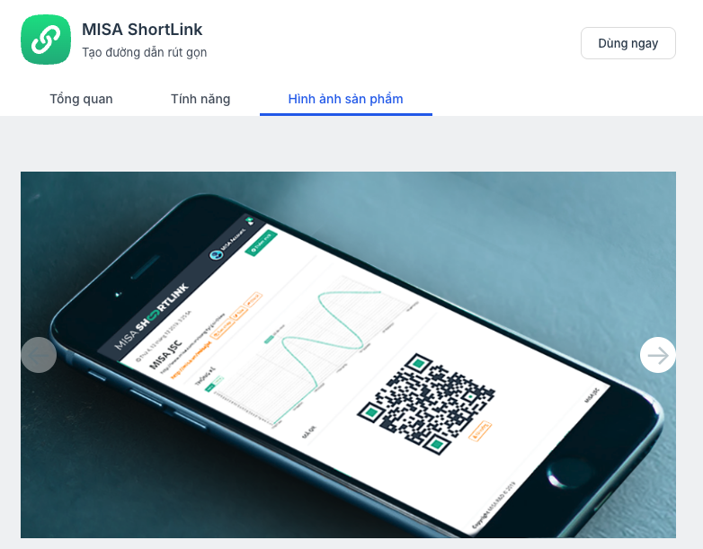

**Description:** MISA ShortLink product showcase showing URL shortening service on mobile.

**Header:**
- App: "MISA ShortLink"
- Subtitle: "Tạo đường dẫn rút gọn" (Create shortened URLs)
- Button: Dùng ngay (Use Now)

**Tabs:** Tổng quan (Overview), Tính năng (Features), Hình ảnh sản phẩm (Product Images - active)

**Image:**
- iPhone showing MISA ShortLink interface
- Displaying shortened URL: MISA.JSC
- QR code for quick access
- Analytics graph showing click tracking

---

### Image 66: OneAI - Product Overview
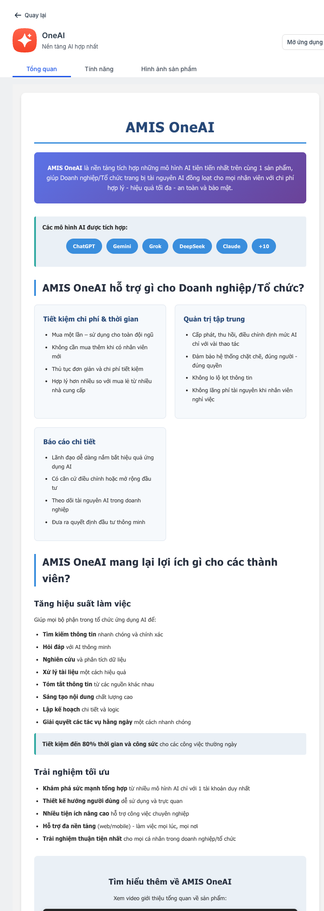

**Description:** OneAI product page explaining the AI platform capabilities.

**Header:**
- App: "OneAI"
- Subtitle: "Nền tảng AI hợp nhất" (Unified AI Platform)
- Button: Mở ứng dụng (Open App)

**Main Content:**

**OneAI Description:**
"AMIS OneAI là nền tảng tích hợp những mô hình AI tiên tiến nhất trên cùng 1 sản phẩm, giúp Doanh nghiệp/Tổ chức trang bị tài nguyên AI đồng loạt cho mọi nhân viên với chi phí hợp lý - hiệu quả tối đa - an toàn và bảo mật."

**Integrated AI Models:**
- ChatGPT, Gemini, Grok, DeepSeek, Claude, +10

**Benefits for Business/Organization:**

**1. Tiết kiệm chi phí & thời gian (Save Cost & Time):**
- Mua một lần - sử dụng cho toàn đội ngũ (Buy once - use for entire team)
- Không cần mua thêm khi có nhân viên mới (No need to buy more for new employees)
- Thủ tục đơn giản và chi phí tiết kiệm (Simple procedures and cost-effective)
- Hợp lý hơn nhiều so với mua lẻ từ nhiều nhà cung cấp (Much better than buying individually from multiple providers)

**2. Quản trị tập trung (Centralized Management):**
- Cấp phát, thu hồi, điều chỉnh định mức AI chỉ với vài thao tác (Allocate, recover, adjust AI quotas with a few clicks)
- Đảm bảo hệ thống chặt chẽ, đúng người - đúng quyền (Ensure strict system, right person - right access)
- Không lo lộ lọt thông tin (No worry about information leaks)
- Không lãng phí tài nguyên khi nhân viên nghỉ việc (No resource waste when employees leave)

**3. Báo cáo chi tiết (Detailed Reports):**
- Lãnh đạo dễ dàng nắm bắt hiệu quả ứng dụng AI (Leaders easily grasp AI application effectiveness)
- Có căn cứ điều chỉnh hoặc mở rộng đầu tư (Basis for adjustment or expansion of investment)
- Theo dõi tài nguyên AI trong doanh nghiệp (Track AI resources in enterprise)
- Đưa ra quyết định đầu tư thông minh (Make smart investment decisions)

**Benefits for Members:**

**Tăng hiệu suất làm việc (Increase Productivity):**
- Tìm kiếm thông tin nhanh chóng và chính xác (Quick and accurate information search)
- Hỏi đáp với AI thông minh (Smart AI Q&A)
- Nghiên cứu và phân tích dữ liệu (Research and data analysis)
- Xử lý tài liệu một cách hiệu quả (Efficient document processing)
- Tóm tắt thông tin từ các nguồn khác nhau (Summarize information from various sources)
- Sáng tạo nội dung chất lượng cao (High-quality content creation)
- Lập kế hoạch chi tiết và logic (Detailed and logical planning)
- Giải quyết các tác vụ hàng ngày một cách nhanh chóng (Quickly solve daily tasks)

**Saves up to 80% time and effort for daily tasks**

**Tối ưu trải nghiệm (Optimized Experience):**
- Khám phá sức mạnh tổng hợp từ nhiều mô hình AI với 1 tài khoản duy nhất (Explore combined power of multiple AI models with 1 account)
- Thiết kế hướng người dùng dễ sử dụng và trực quan (User-friendly and intuitive design)
- Nhiều tiện ích nâng cao hỗ trợ công việc chuyên nghiệp (Many advanced utilities for professional work)
- Hỗ trợ đa nền tảng (web/mobile) - làm việc mọi lúc, mọi nơi (Multi-platform support - work anytime, anywhere)
- Trải nghiệm thuận tiện nhất cho mọi cá nhân trong doanh nghiệp/tổ chức (Most convenient experience for everyone)

---

### Image 67: Workflow - Dashboard
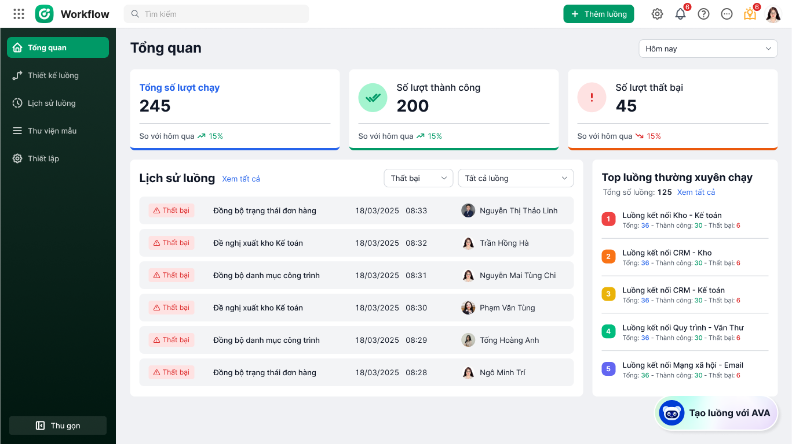

**Description:** Workflow automation dashboard showing run statistics and history.

**Header:**
- App: "Workflow"
- Button: + Thêm luồng (Add Flow)

**Left Navigation:**
- Tổng quan (Overview) - Active
- Thiết kế luồng (Design Flow)
- Lịch sử luồng (Flow History)
- Thư viện mẫu (Template Library)
- Thiết lập (Settings)

**Top Summary Cards:**
- **Tổng số lượt chạy (Total runs):** 245 (↑15% vs yesterday)
- **Số lượt thành công (Successful):** 200 (↑15% vs yesterday)
- **Số lượt thất bại (Failed):** 45 (↓15% vs yesterday)

**Flow History (Lịch sử luồng):**
- Filter: Thất bại (Failed), Tất cả luồng (All flows)
- Recent failed runs:
  - Đồng bộ trạng thái đơn hàng (Sync order status) - 18/03/2025 08:33 - Nguyễn Thị Thảo Linh
  - Đề nghị xuất kho Kế toán (Accounting warehouse request) - 08:32 - Trần Hồng Hà
  - Đồng bộ danh mục công trình (Sync project catalog) - 08:31 - Nguyễn Mai Tùng Chi
  - Multiple other failed syncs

**Top Frequently Run Flows (Top luồng thường xuyên chạy):**
1. Luồng kết nối Kho - Kế toán (Warehouse-Accounting): 36 total, 30 success, 6 failed
2. Luồng kết nối CRM - Kho (CRM-Warehouse): 36 total, 30 success, 6 failed
3. Luồng kết nối CRM - Kế toán (CRM-Accounting): 36 total, 30 success, 6 failed
4. Luồng kết nối Quy trình - Văn Thư (Workflow-Correspondence): 36 total, 30 success, 6 failed
5. Luồng kết nối Mạng xã hội - Email (Social-Email): 36 total, 30 success, 6 failed

**Bottom Right:** "Tạo luồng với AVA" (Create flow with AVA) - AI assistant

---

### Image 68: Purchasing - Quotation Approval
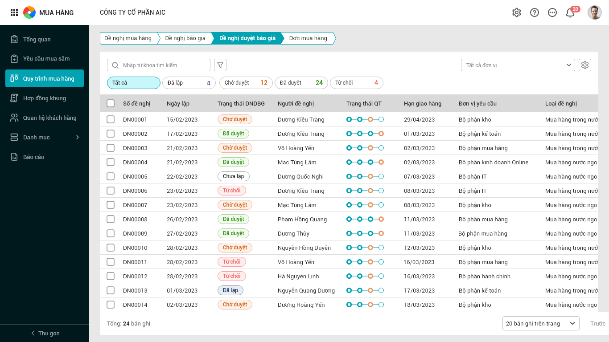

**Description:** Purchasing module showing quotation approval workflow.

**Header:**
- App: "MUA HÀNG" (Purchasing)
- Company: "CÔNG TY CỔ PHẦN AIC" (AIC Joint Stock Company)
- Workflow steps: Đề nghị mua hàng → Đề nghị báo giá → Đề nghị duyệt báo giá (active) → Đơn mua hàng

**Left Navigation:**
- Tổng quan (Overview)
- Yêu cầu mua sắm (Purchase Requests)
- Quy trình mua hàng (Purchasing Process) - Active
- Hợp đồng khung (Framework Contracts)
- Quan hệ khách hàng (Customer Relations)
- Danh mục (Categories)
- Báo cáo (Reports)

**Main Content:**
- Tabs: Tất cả (All), Đã lập (Created) 8, Chờ duyệt (Pending) 12, Đã duyệt (Approved) 24, Từ chối (Rejected) 4

**Table Columns:**
- Số đề nghị (Request number)
- Ngày lập (Created date)
- Trạng thái DNDBG (Quotation status)
- Người đề nghị (Requester)
- Trạng thái QT (Process status)
- Hạn giao hàng (Delivery deadline)
- Đơn vị yêu cầu (Requesting unit)
- Loại đề nghị (Request type)

**Sample Requests:**
- DN0001: 15/02/2023 - Chờ duyệt - Dương Kiều Trang - 29/04/2023 - Bộ phận kho - Mua hàng trong nước
- DN0002: 17/02/2023 - Đã duyệt - Dương Kiều Trang - 01/03/2023 - Bộ phận kế toán - Mua hàng trong nước
- Various other requests with different statuses

---

### Image 69: Purchasing - Purchase Requests
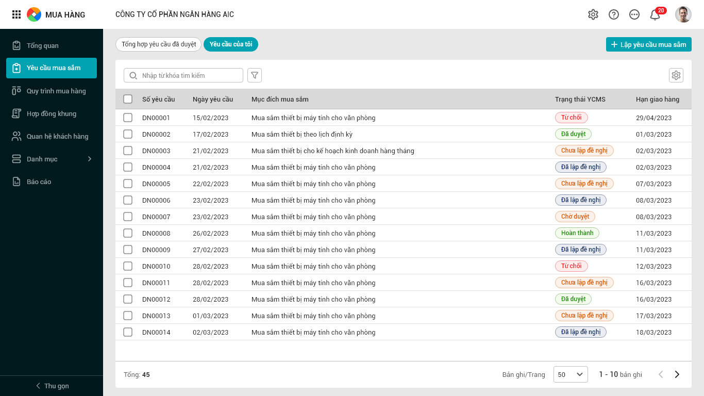

**Description:** Purchasing module showing purchase request list.

**Header:**
- Company: "CÔNG TY CỔ PHẦN NGÂN HÀNG AIC" (AIC Bank Joint Stock Company)
- Tabs: Tổng hợp yêu cầu đã duyệt (Approved requests), Yêu cầu của tôi (My requests) - Active
- Button: + Lập yêu cầu mua sắm (Create Purchase Request)

**Main Table:**
Columns: Số yêu cầu (Request number), Ngày yêu cầu (Request date), Mục đích mua sắm (Purchase purpose), Trạng thái YCMS (Request status), Hạn giao hàng (Delivery deadline)

**Sample Requests:**
- DN0001: 15/02/2023 - "Mua sắm thiết bị máy tính cho văn phòng" (Office computer equipment) - Từ chối (Rejected)
- DN0002: 17/02/2023 - "Mua sắm thiết bị theo lịch định kỳ" (Scheduled equipment) - Đã duyệt (Approved)
- DN0003-DN0014: Various office computer equipment requests with different statuses

**Status Types:**
- Từ chối (Rejected)
- Đã duyệt (Approved)
- Chưa lập đề nghị (Not yet proposed)
- Đã lập đề nghị (Proposed)
- Chờ duyệt (Pending)
- Hoàn thành (Completed)

---

### Image 70: Purchasing - Quotation Detail
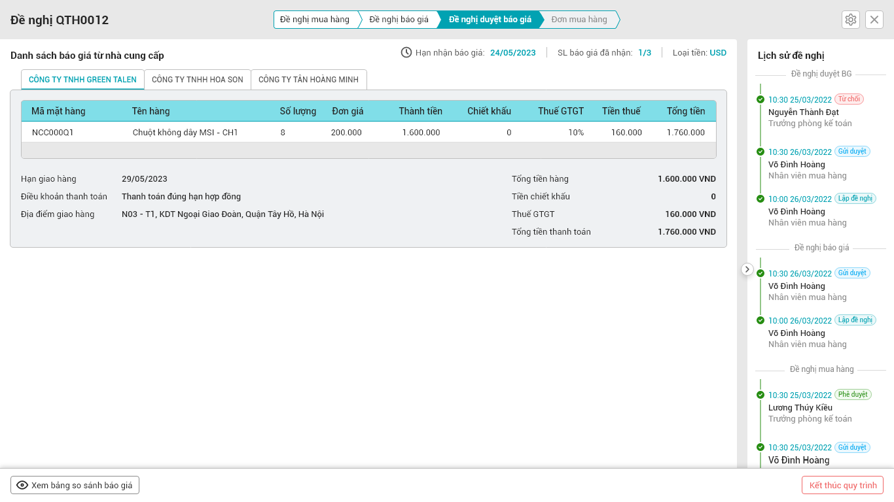

**Description:** Detailed quotation comparison and approval history.

**Header:**
- Request: "Đề nghị QTH0012"
- Workflow steps: Đề nghị mua hàng → Đề nghị báo giá → Đề nghị duyệt báo giá (active) → Đơn mua hàng
- Deadline: 24/05/2023
- Quotations received: 1/3
- Currency: USD

**Supplier Tabs:**
- CÔNG TY TNHH GREEN TALEN (active)
- CÔNG TY TNHH HOA SON
- CÔNG TY TÂN HOÀNG MINH

**Quotation Table:**
- Mã mặt hàng: NCC000Q1
- Tên hàng: Chuột không dây MSI - CH1 (MSI Wireless Mouse)
- Số lượng: 8
- Đơn giá: 200,000
- Thành tiền: 1,600,000
- Chiết khấu: 0
- Thuế GTGT: 10%
- Tiền thuế: 160,000
- Tổng tiền: 1,760,000

**Summary:**
- Tổng tiền hàng: 1,600,000 VND
- Tiền chiết khấu: 0
- Thuế GTGT: 160,000 VND
- Tổng tiền thanh toán: 1,760,000 VND

**Delivery Info:**
- Hạn giao hàng: 29/05/2023
- Điều khoản thanh toán: Thanh toán đúng hạn hợp đồng
- Địa điểm giao hàng: N03 - T1, KĐT Ngoại Giao Đoàn, Quận Tây Hồ, Hà Nội

**Right Panel - Request History (Lịch sử đề nghị):**
Timeline showing approval steps:
- Đề nghị duyệt BG (Quotation approval request)
  - 10:30 25/03/2022 - Nguyễn Thanh Đạt - Trưởng phòng kế toán - Từ chối (Rejected)
  - 10:30 26/03/2022 - Võ Đình Hoàng - Nhân viên mua hàng - Gửi duyệt (Sent for approval)
  - 10:00 26/03/2022 - Võ Đình Hoàng - Lập đề nghị (Created request)
- Đề nghị báo giá (Quotation request)
  - 10:30 26/03/2022 - Gửi duyệt
  - 10:00 26/03/2022 - Lập đề nghị
- Đề nghị mua hàng (Purchase request)
  - 10:30 25/03/2022 - Lương Thúy Kiều - Trưởng phòng kế toán - Phê duyệt (Approved)
  - 10:30 25/03/2022 - Võ Đình Hoàng - Gửi duyệt

---

### Image 71: Mobile App Setup Guide
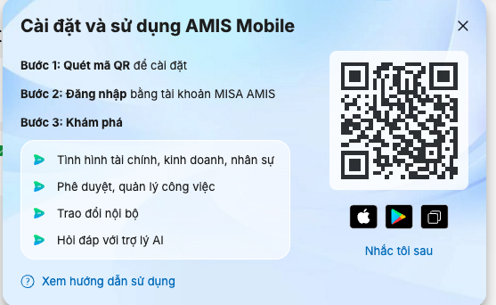

**Description:** QR code guide for setting up AMIS Mobile app.

**Title:** "Cài đặt và sử dụng AMIS Mobile" (Install and Use AMIS Mobile)

**Steps:**
1. Bước 1: Quét mã QR để cài đặt (Scan QR code to install)
2. Bước 2: Đăng nhập bằng tài khoản MISA AMIS (Login with MISA AMIS account)
3. Bước 3: Khám phá (Explore)

**Features List:**
- Tình hình tài chính, kinh doanh, nhân sự (Financial, business, HR status)
- Phê duyệt, quản lý công việc (Approvals, task management)
- Trao đổi nội bộ (Internal communication)
- Hỏi đáp với trợ lý AI (AI assistant Q&A)

**QR Code:** Large QR code for scanning
**Download Buttons:** Apple App Store, Google Play Store

**Links:** "Nhắc tôi sau" (Remind me later), "Xem hướng dẫn sử dụng" (View user guide)

---

### Image 72: Mobile App - App Grid
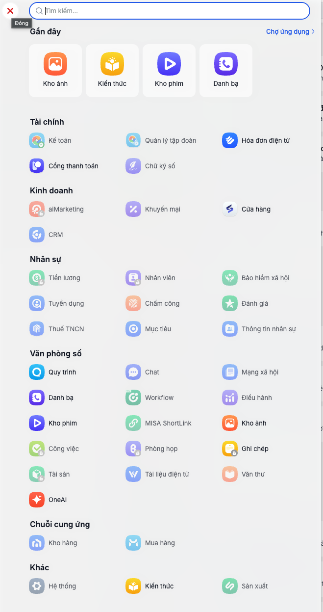

**Description:** Mobile app interface showing all available apps in categorized grid.

**Top:**
- Search bar
- "Gần đây" (Recent): Kho ảnh, Kiến thức, Kho phim, Danh bạ
- "Chợ ứng dụng" (App Market) link

**Categories:**

**Tài chính (Finance):**
- Kế toán (Accounting)
- Quản lý tập đoàn (Group Management)
- Hóa đơn điện tử (E-Invoice)
- Cổng thanh toán (Payment Gateway)
- Chữ ký số (Digital Signature)

**Kinh doanh (Business):**
- aiMarketing
- Khuyến mại (Promotion)
- Cửa hàng (Store)
- CRM

**Nhân sự (HR):**
- Tiền lương (Payroll)
- Nhân viên (Employee)
- Bảo hiểm xã hội (Social Insurance)
- Tuyển dụng (Recruitment)
- Chấm công (Time Tracking)
- Đánh giá (Evaluation)
- Thuế TNCN (PIT)
- Mục tiêu (Objectives)
- Thông tin nhân sự (HR Info)

**Văn phòng số (Digital Office):**
- Quy trình (Workflow)
- Chat
- Mạng xã hội (Social Network)
- Danh bạ (Contacts)
- Workflow
- Điều hành (Operations)
- Kho phim (Video Library)
- MISA ShortLink
- Kho ảnh (Photo Library)
- Công việc (Tasks)
- Phòng họp (Meeting Room)
- Ghi chép (Notes)
- Tài sản (Assets)
- Tài liệu điện tử (Electronic Documents)
- Văn thư (Correspondence)
- OneAI

**Chuỗi cung ứng (Supply Chain):**
- Kho hàng (Warehouse)
- Mua hàng (Purchasing)

**Khác (Other):**
- Hệ thống (System)
- Kiến thức (Knowledge)
- Sản xuất (Production)

---

### Image 73: Mobile App - Marketplace
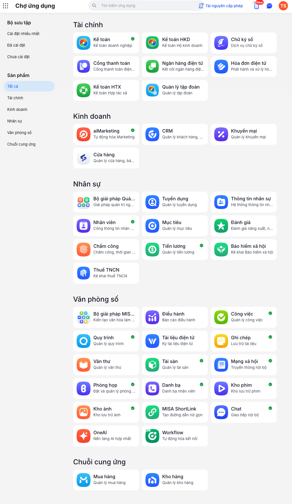

**Description:** Mobile app marketplace showing all available apps organized by category.

**Header:**
- Title: "Chợ ứng dụng" (App Market)
- Search: "Tìm kiếm ứng dụng" (Search apps)
- "Tài nguyên cấp phép" (License resources), New notification icon, User avatar "TS"

**Left Sidebar:**
- Bộ sưu tập (Collections): Cài đặt nhiều nhất (Most installed), Đã cài đặt (Installed), Chưa cài đặt (Not installed)
- Sản phẩm (Products): Tất cả (All), Tài chính (Finance), Kinh doanh (Business), Nhân sự (HR), Văn phòng số (Digital Office), Chuỗi cung ứng (Supply Chain)

**Main Content - Same as Image 06 but in mobile format:**

**Finance Section (Tài chính):** 8 apps
**Business Section (Kinh doanh):** 4 apps
**HR Section (Nhân sự):** 10 apps
**Digital Office Section (Văn phòng số):** 17 apps
**Supply Chain Section (Chuỗi cung ứng):** 2 apps

All apps with green checkmarks indicating installed status.

---

## 🎯 Complete Module Summary

Based on all 73 screenshots, the ERP system includes:

### Core Modules (41+ Applications)

| Category | Applications |
|----------|-------------|
| **Tài chính (Finance)** | Kế toán, Kế toán HKD, Kế toán HTX, Chữ ký số, Cổng thanh toán, Ngân hàng điện tử, Hóa đơn điện tử, Quản lý tập đoàn |
| **Kinh doanh (Business)** | aiMarketing, CRM, Khuyến mại, Cửa hàng |
| **Nhân sự (HR)** | Nhân viên, Tuyển dụng, Chấm công, Tiền lương, Mục tiêu, Đánh giá, Bảo hiểm xã hội, Thuế TNCN, Quan hệ lao động |
| **Văn phòng số (Digital Office)** | Công việc, Quy trình, Tài sản, Tài liệu điện tử, Ghi chép, Văn thư, Mạng xã hội, Phòng họp, Danh bạ, Kho phim, Kho ảnh, Chat, OneAI, Workflow, WeSign, MISA ShortLink, Điều hành |
| **Chuỗi cung ứng (Supply Chain)** | Mua hàng, Kho hàng |

### Key Features Across All Modules

1. **Dashboard & Analytics** - Every module has comprehensive dashboards with KPIs, charts, and reports
2. **Workflow Integration** - Cross-module workflow automation and approval processes
3. **Role-Based Access** - Permission management at user, role, and department levels
4. **Multi-Company Support** - Group management with subsidiary data consolidation
5. **Mobile Support** - Full mobile app with all core features
6. **AI Integration** - OneAI platform with multiple AI models
7. **Real-Time Notifications** - Push notifications and in-app alerts
8. **Data Export** - Export functionality for all reports and lists

---

## 📦 Complete Asset Inventory

| File | Description | Size |
|------|-------------|------|
| image_01.png | Core ERP modules overview diagram | 348 KB |
| image_02.png | Employee onboarding email template | 86 KB |
| image_03.png | Platform onboarding guide (steps 1-3) | 286 KB |
| image_04.png | Platform onboarding guide (steps 4-5) | 213 KB |
| image_05.png | Desktop app dashboard (my apps) | 758 KB |
| image_06.png | Application marketplace full catalog | 692 KB |
| image_07.png | Application marketplace installed apps | 486 KB |
| image_08.png | Asset management product detail page | 200 KB |
| image_09.png | aiMarketing product screenshots | 130 KB |
| image_10.png | aiMarketing features specification | 144 KB |
| image_11.png | Asset management dashboard | 123 KB |
| image_12.png | Asset management dashboard (duplicate) | 123 KB |
| image_13.png | Workflow run history list | 165 KB |
| image_14.png | aiMarketing dashboard (duplicate) | 159 KB |
| image_15.png | Accounting financial dashboard | 109 KB |
| image_16.png | Room booking calendar view | 89 KB |
| image_17.png | Task management dashboard | 1,203 KB |
| image_18.png | Notes/documentation library | 99 KB |
| image_19.png | Internal social network feed | 630 KB |
| image_20.png | Payroll dashboard overview | 241 KB |
| image_21.png | Time tracking timesheet calendar | 146 KB |
| image_22.png | Task processing in chat marketing | 512 KB |
| image_23.png | Video library add video modal | 242 KB |
| image_24.png | Photo library viewer with comments | 1,276 KB |
| image_25.png | Accounting workflow diagram | 122 KB |
| image_26.png | Digital signature certificate management | 80 KB |
| image_27.png | JetPay payment gateway dashboard | 126 KB |
| image_28.png | E-invoice management dashboard | 306 KB |
| image_29.png | Cooperative accounting purchasing dashboard | 103 KB |
| image_30.png | Group management data management | 83 KB |
| image_31.png | aiMarketing dashboard (duplicate) | 159 KB |
| image_32.png | aiMarketing dashboard (duplicate) | 159 KB |
| image_33.png | Promotion analysis report | 158 KB |
| image_34.png | Retail POS system interface | 315 KB |
| image_35.png | HR employee database detail | 328 KB |
| image_36.png | Recruitment candidate pipeline | 119 KB |
| image_37.png | HR overview dashboard | 153 KB |
| image_38.png | Time tracking timesheet (duplicate) | 146 KB |
| image_39.png | Objective management table view | 169 KB |
| image_40.png | Objective management mind map | 192 KB |
| image_41.png | Strategy map (BSC) | 84 KB |
| image_42.png | Add objective form modal | 119 KB |
| image_43.png | Create evaluation period form | 368 KB |
| image_44.png | Evaluation Gantt chart timeline | 463 KB |
| image_45.png | Evaluation results radar chart | 344 KB |
| image_46.png | Evaluation template library | 1,458 KB |
| image_47.png | Time tracking overview dashboard | 136 KB |
| image_48.png | Shift schedule setup form | 100 KB |
| image_49.png | Shift schedule summary table | 128 KB |
| image_50.png | Payroll dashboard (duplicate) | 241 KB |
| image_51.png | Payroll income summary report | 122 KB |
| image_52.png | Social insurance electronic records | 214 KB |
| image_53.png | Create social insurance record modal | 80 KB |
| image_54.png | Social insurance employee list | 242 KB |
| image_55.png | Task management dashboard (duplicate) | 160 KB |
| image_56.png | Workflow run history (different view) | 103 KB |
| image_57.png | WeSign electronic signature dashboard | 395 KB |
| image_58.png | Social network feed (duplicate) | 311 KB |
| image_59.png | Asset management dashboard (duplicate) | 294 KB |
| image_60.png | Operations dashboard system admin | 151 KB |
| image_61.png | Operations workflow statistics | 128 KB |
| image_62.png | Operations financial management | 104 KB |
| image_63.png | Operations HR management | 138 KB |
| image_64.png | WeSign dashboard (duplicate) | 185 KB |
| image_65.png | MISA ShortLink product image | 327 KB |
| image_66.png | OneAI product overview | 819 KB |
| image_67.png | Workflow automation dashboard | 522 KB |
| image_68.png | Purchasing quotation approval | 311 KB |
| image_69.png | Purchasing purchase requests | 630 KB |
| image_70.png | Purchasing quotation detail | 395 KB |
| image_71.png | Mobile app QR setup guide | 344 KB |
| image_72.png | Mobile app grid view | 146 KB |
| image_73.png | Mobile app marketplace | 327 KB |

**Total Images:** 73  
**Total Size:** ~15 MB  

---

## 📝 AI Features Specification (OneAI)

Based on issue comment (2026-04-13 07:25:09) and Image 66:

### Admin Features (Chức năng Quản trị)

**Resource Management:**
- **Phân quyền và quản lý người dùng** - Role-based access control with detailed permissions
- **Thiết lập định mức tài nguyên** - Resource quota settings to prevent abuse and optimize costs
- **Báo cáo tình hình sử dụng đa chiều** - Multi-dimensional usage reports by user, time, feature type, and AI model

### User Features (Chức năng cho Mọi Người dùng)

#### AI Chat (Trò chuyện với AI)
- **Đa mô hình AI** - Multiple AI models (GPT, Claude, Gemini, DeepSeek, Grok + 10 more)
- **Hỏi đáp thông tin** - Q&A, consulting, and decision support

#### Content Creation (Tạo nội dung)
- **Tạo ảnh** - Text-to-image generation with high quality
- **Tạo file** - Auto-export documents, spreadsheets, presentations
- **Nghiên cứu sâu** - Complex data analysis and information synthesis

#### Specialized Tools (Bộ công cụ chuyên biệt)

**10 AI-Powered Tools:**
1. **Sáng tạo nội dung** - Article writing, script creation, idea development
2. **Dịch thuật** - Multi-language translation (accurate and natural)
3. **Tóm tắt** - Document summarization to key points
4. **Phân tích tài liệu** - File reading and information extraction
5. **Soạn email** - Professional email generation
6. **Lập kế hoạch** - Roadmap building and resource allocation
7. **Lập báo cáo** - Automated report generation from raw data
8. **Hỗ trợ thiết kế** - UI/UX design consulting, layout, colors
9. **Trợ lý Excel** - Formula creation, spreadsheet data analysis
10. **Thư viện prompt** - Optimized prompt templates for each domain

#### Advanced Features (Tính năng nâng cao)
- **Tích hợp trình duyệt** - Browser integration for AI while browsing
- **Tạo bot tùy chỉnh** - Custom chatbot building

### Mobile Version (Phiên bản Mobile)

**Mobile Features:**
- **Trò chuyện AI di động** - Mobile AI chat with multi-model support anytime, anywhere
- **Tạo ảnh từ điện thoại** - AI image generation on mobile
- **Khám phá công cụ** - Full access to specialized tools
- **Đồng bộ đa thiết bị** - Cross-device sync with secure chat history and document storage

**App Download:** http://onelink.to/ezkz3e

---

## 📱 Mobile Application Features

Based on Images 71-73:

- Native iOS and Android apps
- QR code installation
- Full app catalog (41+ apps)
- All core features accessible
- Biometric authentication
- Push notifications
- Offline mode for key features
- Cross-device synchronization

---

## ✅ Implementation Checklist

### Phase 1: Core Accounting & Finance
- [x] General ledger dashboard
- [x] Cash and deposit management
- [x] Banking integration
- [x] Invoice management with e-invoice
- [x] Tax reporting
- [x] Financial analysis charts
- [x] Receivables/payables tracking

### Phase 2: HR Management
- [x] Employee database with profiles
- [x] Recruitment pipeline (Kanban)
- [x] Time & attendance tracking
- [x] Shift scheduling
- [x] Payroll processing with reports
- [x] Social insurance declaration
- [x] Performance evaluation (360°)
- [x] Objective management (MBO/OKR/KPI/BSC)

### Phase 3: Business Operations
- [x] Sales with POS system
- [x] Purchasing workflow
- [x] Inventory/warehouse
- [x] Contract management
- [x] Asset management with tracking
- [x] CRM integration
- [x] Marketing automation (aiMarketing)
- [x] Promotion management

### Phase 4: Digital Office
- [x] Task management
- [x] Workflow automation
- [x] Internal communication (Chat)
- [x] Document management
- [x] Meeting room booking
- [x] Photo/Video library
- [x] Notes/knowledge base
- [x] Internal social network
- [x] Electronic signature (WeSign)

### Phase 5: AI Integration
- [x] OneAI platform setup
- [x] Multi-model AI (ChatGPT, Gemini, Grok, DeepSeek, Claude)
- [x] Content creation tools
- [x] Specialized AI assistants
- [x] Browser extension
- [x] Custom bot builder

### Phase 6: Operations & Administration
- [x] Operations dashboard
- [x] System usage analytics
- [x] Financial administration
- [x] HR administration
- [x] Cross-module reports

### Phase 7: Mobile
- [x] iOS/Android app
- [x] QR code installation
- [x] Full app catalog
- [x] All core features
- [x] Cross-device sync

---

## 📞 Additional Resources

- **Google Mail Reference:** FMfcgzQgLPMRnWRTSxxtWKxTKlhDCgrP
- **App Download Link:** http://onelink.to/ezkz3e
- **GitHub Issue:** https://github.com/stevennt/abn.launchpad/issues/632
- **GitHub Repository:** https://github.com/stevennt/abn.erp.misa

---

*Document generated from GitHub Issue #632 with detailed analysis of all 73 screenshots on April 14, 2026*
